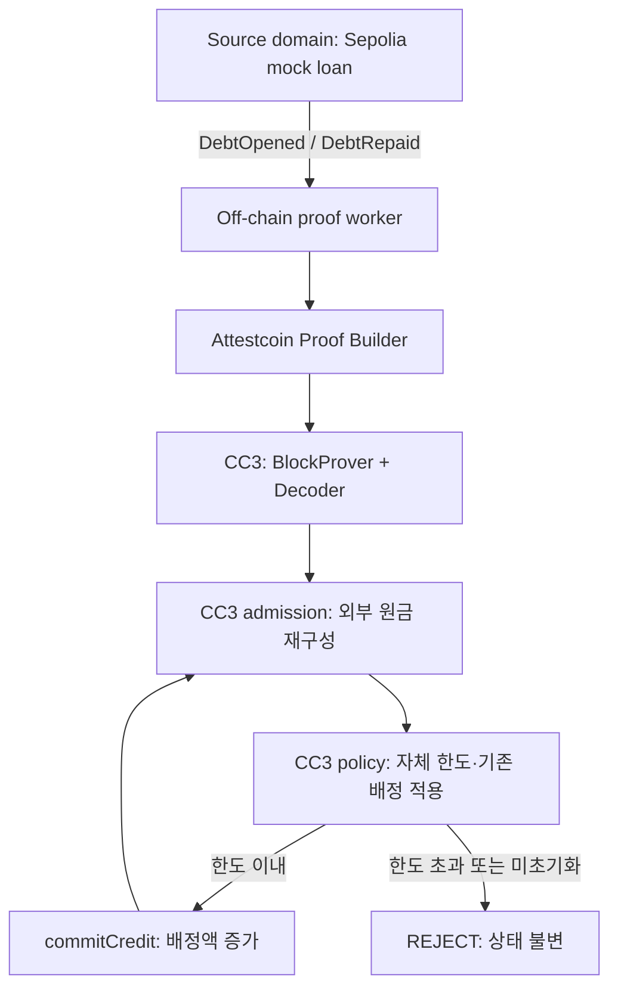

# Proof-to-Credit — BUIDL CTC 1차 해커톤 실행 계획

**목표:** Sepolia의 모의 대출 이벤트에서 재구성한 원금 상태를, CC3의 별도 신용 배정 정책이 검증 가능한 외부 입력으로 소비하는 과정을 실증한다. 한도 계산은 이 입력이 실제 동작에 사용됨을 보여주는 데모다.

**Architecture:** 최초 한 번만 원금을 개설하고 이후에는 상환만 허용하는 source 계약과, proof 검증·원장·정책·신용 배정을 담당하는 destination 계약을 만든다. source 계약의 단방향 원금 감소와 destination의 원자적 한도 소비를 결합한다.

**Tech Stack:** Solidity, Node.js, ethers v6, solc-js, Attestcoin Proof Builder API, BlockProver, EvmV1Decoder. 구체 버전은 참고 저장소 lockfile을 기준으로 초기 검증 후 고정한다.

**Spec:** 이 문서 §1–9가 설계 명세이며 §11–13이 실행 계획이다. 이후 개발자는 둘을 함께 읽는다. 이번 산출물은 계획이며, 새 애플리케이션 코드를 구현·배포한 결과가 아니다.

**기준 시각:** 2026-09-05 UTC / 2026-09-06 KST. 일정표는 한국시간이다. 작업 시작은 9월 6일로 가정한다.

**참고 저장소 고정 revision:** `0dec5aef93937b9fd1d8ef02a83455e146eafe24`.

**부분 개정:** 기존 Gold Headroom의 명칭·문제 정의·발표 중심을 수정했다. 파일명은 이전 문서와의 연결을 위해 유지한다.

**이번 검토 판정: A — 그대로 개발.** 이는 architecture·기능 범위를 그대로 구현한다는 뜻이며, 발표 문구는 이 개정본을 사용한다. **추가 기능 0개. 내일 T01–T02 착수: YES.** 첫 프롬프트는 명칭·목표·주장 범위만 고쳤다.

**수정 범위:** §1·2·4의 설명·10의 narrative·13·15·17의 최종 판정, 그리고 T01·T12·T16·T17의 설명/기존 증거 표시 지침. §3, §5–9, §11, §14, §16 및 나머지 Task는 유지한다. contract·event ABI, state 필드, single-draw, proof path, 날짜별 일정, T0+48시간 기준은 바꾸지 않는다.

## 근거 표기와 공통 제약

| 표기 | 이 문서에서의 의미 |
|---|---|
| **VERIFIED** | 이번 작업에서 직접 읽은 코드·공식 원문 또는 직접 조회한 응답으로 확인. 원문 확인과 실제 실행 확인을 구분해 적는다. |
| **REFERENCE CONFIRMED** | 참고 저장소의 코드·실행 기록에서 확인했으나, 그 실행을 이번 작업에서 재현하지는 않았다. |
| **ASSUMPTION** | 일정·사용자 환경·산업 참조 등 계획을 위해 놓은 가정. |
| **DESIGN CHOICE** | 이번 MVP에서 선택한 동작·수식·경계. 아직 구현 결과가 아니다. |
| **UNKNOWN** | 자료 접근 또는 실행 증거가 부족한 항목. 담당 작업과 판정 시점을 지정한다. |

각 설계 절의 기본 표기는 DESIGN CHOICE다. 참고 저장소가 스스로 붙인 VERIFIED를 이 문서의 직접 검증으로 승격하지 않는다.

- 사용자 지시대로 질문을 선행하지 않고 합리적인 가정을 명시해 계획을 완성한다.
- 새 프로젝트는 별도 저장소에서 구현한다. 참고 저장소 수정·재배포·push는 하지 않는다.
- 한 source venue, 한 loan, 한 borrower, 한 quote unit, 한 destination gate로 제한한다.
- 최초 source 대출 개설 이후 추가 차입·재개설·이자·원금 증가·업그레이드를 허용하지 않는다.
- 금 존재·금 소유권·담보권·실제 상환 자금·전체 익스포저를 증명한다고 주장하지 않는다.
- 실제 proof를 destination 계약이 검증하고 성공한 testnet 트랜잭션으로 상태를 기록해야 E2E 성공이다.
- 개발자는 각 Task의 acceptance criteria와 증거를 기록한 후 해당 작업만 commit한다. 공개 push·제출은 별도 작업이다.

---

## 1. Executive Summary

### 무엇을 만드는가

**DESIGN CHOICE — 추천 이름: Proof-to-Credit.**

**한 source 금융 계약에서 발생한 이벤트를 검증해 특정 대출의 원금 상태를 재구성하고, 다른 실행 도메인의 신용 정책이 그 상태를 입력으로 소비하는 애플리케이션 primitive**를 만든다. 여기서 primitive는 재사용 가능한 구성 단위를 뜻하며, 새로운 암호학적 증명 방식이나 업계 최초 기능이라는 뜻은 아니다.

구체적인 검증 대상은 **single-draw 모의 loan의 원금**이다. 범용 financial state 엔진, 전체 차주 신용 상태, cross-chain 전체 익스포저를 구현하는 것은 아니다.

핵심 구성은 세 책임으로 나뉜다.

1. **Source venue / Sepolia:** 개설·상환을 실행하고 자기 장부와 이벤트를 갱신한다.
2. **Proof admission / CC3:** Attestcoin proof를 실제 runtime에서 검증하고, 동일한 bytes의 receipt·emitter·서명·업무 순서를 확인해 원금을 재구성한다.
3. **Credit policy / CC3:** source가 정해 준 승인 결과가 아니라, 재구성한 원금에 destination 자신의 한도와 기존 배정액을 적용한다. 성공한 배정은 destination 한도를 원자적으로 소비한다.

Source와 destination은 서로 다른 chain·contract state 및 정책 책임을 갖는다. 다만 둘 다 우리가 만든 mock이므로 **서로 독립적인 실제 금융기관이 연동되었다는 실증은 아니다.** destination의 원장·정책은 기존처럼 한 계약에 두고 함수 책임과 권한만 구분한다.

### 실제로 보여주는 숫자

source 원금50 proof → destination 요청30/한도60 거절 → source 상환20 proof → destination 원금30으로 재구성 → 같은 정책에서 요청30 허용 → 배정30 기록 후 추가1 거절.

**이 숫자 계산 자체는 기존 lending accounting과 본질적으로 다르지 않다.** 시연의 중심은 50−20=30이 아니라, **그 20을 어느 계약의 어떤 거래로 확인했고 destination이 왜 그 데이터를 자기 정책의 입력으로 받아들였는가**다.

source 개설·상환은 mock accounting이며, destination 배정은 테스트용 한도 점유 기록이다. 실제 대출 지급·상환 자금 이전은 없다. E2E 성공은 실제 testnet 이벤트·proof·destination storage 기록을 뜻한다.

### 의도적으로 유지하는 single-draw 제약

정상 proof는 최신 이벤트의 완전한 수집을 보장하지 않는다. 그래서 source는 최초 개설 이후 원금이 줄기만 하도록 제한한다. 개설 proof를 받은 이후, 누락되거나 늦은 상환은 원금을 과대평가하고 여력을 과소평가하게 한다. **stale state의 오차 방향을 보수적으로 제한한 설계**다. 이자는 없고 재개설·추가 차입·upgrade도 없다.

이 성질은 지정한 loan의 원금에만 성립한다. 전체 금융위험이 보수적으로 측정된다거나 금 담보가 안전하다는 뜻은 아니다. 상세 수식·조건은 §5.5를 유지한다.

### 심사위원에게 보여줄 한 문장

> “Proof-to-Credit은 다른 체인의 대출 이벤트를 Attestcoin으로 검증해 원금 상태를 재구성하고, 별도 신용 배정 정책의 입력으로 사용합니다.”

**정확한 기술 부제:** `Loan-scoped, proof-derived principal state for a separate credit-allocation policy.`

**KGLD 위치:** tokenized-gold finance라는 문제 맥락을 설명하는 demo use case다. 금 보유·소유권·준비금·담보가치가 기능의 중심처럼 보이게 하지 않는다. 선택 근거는 §15.5.

### 만들지 않는 것

금 토큰 발행, 금고·custodian 연결, 준비금 감사, 담보 락업, 가격 오라클, 실제 Morpho/Aave/KGLD 연동, bridge, 추가 체인·시장, 재담보, 청산, 실물 회수, systemic risk, 총 익스포저 계산, 독립 거절 기록 시스템은 이번 범위에 없다.

### 구현 우선순위

| 등급 | 내용 |
|---|---|
| **MUST HAVE** | source 개설·상환 2개 이벤트, 실제 proof 경로, CC3 상태 기록, 순서·중복·emitter·chain 검사, 원자적 신규 배정, 실패 proof 테스트, 배포 증거, 재현 절차, 데모 |
| **SHOULD HAVE** | 읽기 중심 단일 화면, proof/영수증 묶음 내보내기, 자동 재시도·중단 재개 UX, 영문 자막 |
| **NICE TO HAVE** | 두 번째 loan, 가변 금리, collateral event, decision receipt, 추가 체인. 이번 제출 전에는 착수하지 않는다. |

---

## 2. Problem Definition

### 2.1 수정된 문제와 검증 명제

**DESIGN CHOICE:** 목표 사용자는 source 대출을 직접 실행하지 않은 별도 credit operator의 역할이다. 그 operator가 지정한 외부 loan의 원금을 자신의 배정 정책에 사용하려면, 입력의 출처·증거·의미·범위·지연을 구분해야 한다.

**검증 명제:** “지원 source chain의 allowlisted 계약이 남긴 성공 transaction을 destination이 Attestcoin으로 검증하고, 그 안의 순서 있는 loan events로 원금을 재구성해 자신의 credit-allocation 정책에 사용할 수 있는가?”

이 framing은 기술적으로 정확하다. 단, **state 자체의 storage proof를 가져오는 것이 아니라, 검증한 event prefix에서 state를 도출한다**는 점과 **single-draw 조건하의 특정 원금**이라는 범위를 붙여야 한다. `Verified cross-domain financial state`만 쓰면 검증한 범위를 넓게 읽을 수 있다.

**권장 primitive 표현:** `Proof-derived loan state as input to a separate credit policy.` 검증 부품은 Attestcoin에서 가져오고, 이번 애플리케이션은 그 결과를 원금 의미·범위·정책 소비에 연결한다.

### 2.2 Morpho/Aave와 직접 비교

**VERIFIED—문서 확인:** 아래 비교의 기준은 Morpho Blue의 기본 market borrow/repay 경로와 Aave V3의 기본 Pool/debt accounting 경로다. 생태계 전체나 모든 adapter가 외부 proof를 처리하지 못한다는 주장이 아니다. Morpho는 market/position 상태를 관리하고, Aave의 상환은 해당 reserve의 debt token을 소각한다. [Morpho 기본 자산 흐름](https://docs.morpho.org/developers/borrow/tutorials/assets-flow/), [Aave Pool](https://aave.com/docs/aave-v3/smart-contracts/pool)

표에서 PoC 열은 **DESIGN CHOICE**, 비교 해석은 위 기본 경로로 한정한다.

| 질문 | Morpho Blue / Aave V3의 기본 대출 경로 | Proof-to-Credit |
|---|---|---|
| 누가 lending을 실행하는가? | 사용자 호출을 받은 해당 프로토콜 계약이 실제 토큰·position을 처리 | Sepolia 계약은 모의 원금 기록, CC3 계약은 테스트 한도 배정만 처리. 실제 지급은 없음 |
| debt state는 어디에서 생기는가? | 해당 배포의 market·position·reserve/debt-token 상태 | source loan에서 생기고, CC3에는 검증한 이벤트로 도출한 원금 사본이 생김 |
| 자신의 state를 직접 읽는가? | 자신의 계약군 상태를 읽음 | destination도 로컬 state를 읽음. 차이는 그 원금 필드가 외부 transaction의 검증 경로를 거쳐 갱신된다는 것 |
| 외부 domain의 transaction proof를 검증하는가? | 문서화된 기본 borrow/repay 입력 경로에는 이 PoC 형태의 외부 loan transaction inclusion proof가 없음. 이를 확장 불가능으로 해석하지 않음 | `submitSourceTransaction`이 실제 BlockProver를 호출하고 검증한 bytes를 해석 |
| 외부 state가 credit policy의 입력이 되는가? | 외부 가격 등은 이미 사용. 기본 자기 대출 회계와 외부 loan 원금의 proof 기반 도입은 별개 | 지정 외부 loan의 event-derived 원금을 destination 배정 정책이 사용 |
| headroom/limit 계산 자체가 새로운가? | 아님. 기존 accounting·한도·건전성 조건 | 아님. 외부 검증 입력이 실제 결정과 한도 소비에 쓰이는지 보여주는 데모 |
| 정책 결정은 어디에 속하는가? | 해당 market/pool 규칙과 관련 관리 권한 | CC3의 policyOwner와 gate. source 이벤트에 ALLOW/REJECT를 맡기지 않음 |

**VERIFIED—중요한 반례:** Morpho는 oracle을 market dependency로 두고 Aave도 외부 가격 source를 설정한다. 따라서 “기존 DeFi는 자기 데이터만 쓰지만 우리는 외부 데이터를 쓴다”는 차별화는 틀리다. [Morpho market parameters](https://docs.morpho.org/developers/contracts/morpho/), [Aave Oracles](https://aave.com/docs/aave-v3/smart-contracts/oracles)

### 2.3 Chainlink·CEL까지 포함한 검증 대상 비교

| 비교 대상 | 입력·검증 경로 | 이미 겹치는 부분 | 이번 구현에서 다른 부분 |
|---|---|---|---|
| Chainlink PoR / SecureMintPolicy | reserve feed를 소비해 발행 한도 정책 적용 | 외부 검증 데이터→정책→거절 | reserve feed 대신 지정 loan transaction의 receipt를 확인해 원금을 재구성. [공식 정책](https://docs.chain.link/ace/reference/policy-library/secure-mint-policy) |
| Chainlink CCIP | 다른 체인에 arbitrary message를 전달하고 수신 계약이 사용 | cross-chain 데이터→destination action. cross-chain lending도 문서화된 use case | 이번 app의 입력은 직접 검증하는 source transaction inclusion/continuity bundle. 메시지 payload 소비와 입증 대상·인터페이스가 다름. [CCIP 개요](https://docs.chain.link/ccip) |
| Chainlink CRE | workflow 결과를 DON-signed report로 만들고 Forwarder가 서명을 검증해 consumer에 전달 | 외부 데이터 처리와 암호 검증된 보고서의 on-chain 소비 | 이번 app은 보고서의 계산 결과를 받는 대신 source tx bytes를 검증한 뒤 자체 코드로 loan 상태를 도출. [CRE Onchain Write](https://docs.chain.link/cre/guides/workflow/using-evm-client/onchain-write/overview-ts) |
| Collateral Eligibility Ledger | source impairment/restoration tx proof→eligibility→credit gate | **외부 domain의 verified fact를 별도 credit policy에 사용하는 큰 구조는 이미 동일** | 숫자 원금·누적 상환·sequence·single-draw의 보수적 지연 처리 및 destination 배정액 점유가 다름. [CEL 코드](https://github.com/kimsabin725/collateral-eligibility-ledger/blob/0dec5aef93937b9fd1d8ef02a83455e146eafe24/contracts/src/EligibilityLedger.sol) |
| Gluwa 공식 예제 | proof 검증 후 application action 실행 | proof-to-action 자체 | 특정 loan 원금의 의미와 후속 credit allocation을 애플리케이션에서 구성. [USCBase](https://github.com/gluwa/usc-testnet-bridge-examples/blob/main/contracts/sol/USCBase.sol) |

Chainlink 항목은 **VERIFIED—공식 문서**, CEL은 **REFERENCE CONFIRMED—앞선 코드 분석**, 새 구현의 차이는 **DESIGN CHOICE**다. CRE/CCIP 경로도 암호학적 검증을 사용하므로 **“Chainlink는 단순 주장, 우리는 암호 증명”이라고 이분하지 않는다.** Attestcoin 역시 source finality·attestation·checkpoint·runtime의 보안 가정을 가진다. 검증 대상과 신뢰 경계의 차이를 설명할 뿐 상대적 우월성을 입증한 것은 아니다.

**판단:** CCIP/CRE 같은 인프라와 custom consumer로 기능적으로 비슷한 흐름을 만들 여지는 있다. 이 문서는 그런 구성을 구현·비교한 benchmark가 아니다. Attestcoin이 필수인 이유는 선택한 PoC의 실제 검증 경로이기 때문이며, 이 문제를 풀 수 있는 유일한 프로토콜이기 때문이 아니다.

### 2.4 실제 차별점과 단순 데모 로직

| 구분 | 항목 | 정직한 주장 |
|---|---|---|
| 구현의 중심 | 출처가 정해진 외부 loan transaction→검증→원금 상태→별도 정책 소비 | 이 연결을 실행 가능한 작은 구성으로 실증 |
| CEL 대비 차이 | positive impairment flag와 달리 누락에 민감한 숫자 원금을 처리 | 순번·산술 불변 조건과 single-draw 제약을 새 상태 기계에 적용 |
| 설계상 중요한 제약 | 늦은 이벤트가 원금을 과소평가하지 않게 하는 제한 | 지정 loan에 한해 보수적인 지연 허용. 완전성 증명 아님 |
| 정확성을 위한 일반 기능 | replay 방지, 권한 검사, 원자적 배정, version 검사 | 필요하지만 각각 새 발명·경쟁우위는 아님 |
| 데모용 소비 함수 | 원금50−상환20, 한도60, 요청30 | 검증된 입력이 동작을 바꾸는 것을 관찰하기 쉬운 예제 |
| 산업 맥락 | KGLD·tokenized gold | 적용 동기를 설명하는 사례. 제품 연동·gold proof 아님 |

`state + provenance + scope + interpretation`은 설명상의 묶음이다. 새로운 struct/API를 추가하지 않는다. 기존 `getState`, `SourceEventApplied`, source 위치, `lastSequence`, `stateHash`, manifest로 제시할 수 있다.

### 2.5 왜 별도 domain에서 이 값을 쓰는가

**ASSUMPTION:** destination credit operator가 동일 borrower의 특정 외부 약정을 자기 한도에 반영하려는 경우를 가정한다. 이 경우 source 대출을 destination이 직접 실행하지 않았으므로 source ledger와 destination policy의 권한이 나뉜다. 합계 한도60은 이 관계를 쉽게 보여주는 mock policy다.

외부 loan의 상환이 자동으로 다른 시장의 법적 담보권·신용도를 개선하는 것은 아니다. collateral sharing, 실명 신원 연계, 다른 부채의 완전한 파악은 구현하지 않는다. “왜 이 원금을 이 한도에 넣는가”는 정책의 가정이며 proof가 정답으로 만들어 주지 않는다.

### 2.6 반증과 판정 범위

**DESIGN CHOICE—검증할 것:** proof 전에는 미초기화, source 상환만으로는 destination 불변, 올바른 proof 수용 후에만 원금 갱신, 해당 원금으로 destination 정책 실행, 변조/replay 거절. §9와 T07–T14가 이미 이 증거를 요구한다.

**UNKNOWN:** 독립 운영기관의 채택 의사, 범용 adapter로의 재사용성, 대안 인프라 대비 비용·지연·보안 우위는 검증되지 않았다. 기본 mock loan의 두 이벤트만 지원하므로 “모든 금융 domain과 즉시 호환되는 제품”이라고 말하지 않는다.

**판정:** 새로운 금융 수식이나 시장 공백의 발견으로는 근거가 부족하다. 그러나 Attestcoin의 검증 결과를 책임이 분리된 credit policy로 연결하는 제한된 학습·해커톤 실증으로는 충분하다. 큰 구조가 CEL과 겹친다는 사실을 인정하고, **새 원금 상태 기계와 그 안전 조건을 실제 코드·테스트로 제시하는 것**이 원작성의 근거다.

---

## 3. Reference Repo Reverse Engineering

### 3.1 분석 범위와 실제 확인 수준

저장소를 로컬에 받아 README, AGENTS, contracts/src, contracts/scripts, contracts/test, docs, spike, deployment.json, ideation 및 최근 commit 이력을 읽었다. 새 프로젝트를 이 저장소 위에 덮어쓰지 않는다.

| 항목 | 확인 내용 | 수준 |
|---|---|---|
| 고정 revision | `0dec5aef93937b9fd1d8ef02a83455e146eafe24` | VERIFIED—git 조회 |
| 현재 중심 계약 | `EligibilityLedger`, `GatedCreditLine` | VERIFIED—코드 확인 |
| 이전 버전 | `VaultAuthorityLedger`는 회귀용으로 남아 있음 | VERIFIED—코드·compile 목록 확인 |
| 배포 기록 | 2026-08-22 CC3 배포 및 proof ingest 로그 | REFERENCE CONFIRMED |
| ingest 영수증 | 아래 tx의 `status=0x1`, `gasUsed=346458`, 대상 ledger 일치 | VERIFIED—이번 작업의 CC3 RPC 조회 |
| proof 응답 | source block `25745732`, txIndex `121`, chainKey `3`, txBytes 1,536 bytes | VERIFIED—이번 작업의 Proof Builder 응답 |
| Proof Builder health | `healthy`, CC3/ETH RPC 연결 true | VERIFIED—조회 시점 응답. 향후 가용성 보장 아님 |
| 60/60 테스트 | 27+15+10+8의 테스트와 결과 기록 존재 | REFERENCE CONFIRMED. 이번에 60개를 실행하지 않았음 |
| 8~9분 지연 | 8월 17일 측정 41·43 Sepolia blocks | REFERENCE CONFIRMED. 현재 지연 재측정 필요 |

RPC로 재확인한 ingest tx: [CC3 제출 영수증](https://creditcoin3-testnet.subscan.io/tx/0xbf8bda4f6595a1c61043f3897e35056fc0fbc5d9952d3abe8166d7bec68da4df). 성공 영수증을 읽은 것은 우리가 새 proof 검증 트랜잭션을 실행했다는 뜻은 아니다.

### 3.2 파일별 책임

| 파일 | 역할과 읽을 포인트 |
|---|---|
| [AGENTS.md](https://github.com/kimsabin725/collateral-eligibility-ledger/blob/0dec5aef93937b9fd1d8ef02a83455e146eafe24/AGENTS.md) | 기존 프로젝트의 작업 규칙·제약. 참고 프로젝트의 아이디어 확정 상태를 새 프로젝트에 강제하지 않는다. |
| [EligibilityLedger.sol](https://github.com/kimsabin725/collateral-eligibility-ledger/blob/0dec5aef93937b9fd1d8ef02a83455e146eafe24/contracts/src/EligibilityLedger.sol) | owner가 emitter·chain·서명을 등록. proof로만 사건을 수용. earliest impairment와 restoration block을 관리. |
| [GatedCreditLine.sol](https://github.com/kimsabin725/collateral-eligibility-ledger/blob/0dec5aef93937b9fd1d8ef02a83455e146eafe24/contracts/src/GatedCreditLine.sol) | 신규 position·추가 차입·담보 추가를 제한. 상환·담보 출금은 eligibility 검사를 생략하되 소유권·LTV 조건은 유지. |
| [EvmV1Decoder.sol](https://github.com/kimsabin725/collateral-eligibility-ledger/blob/0dec5aef93937b9fd1d8ef02a83455e146eafe24/contracts/src/vendor/EvmV1Decoder.sol) | Gluwa 계약 패키지의 decoder를 vendor. receipt 및 logs 해석. |
| [proofClient.js](https://github.com/kimsabin725/collateral-eligibility-ledger/blob/0dec5aef93937b9fd1d8ef02a83455e146eafe24/spike/src/proofClient.js) | health, attested height, tx hash/위치 기반 proof 조회, 대기·tuple 변환. |
| [config.js](https://github.com/kimsabin725/collateral-eligibility-ledger/blob/0dec5aef93937b9fd1d8ef02a83455e146eafe24/spike/src/config.js) | CC3 RPC, chainKey, BlockProver/ChainInfo ABI 및 endpoint. |
| [compile.js](https://github.com/kimsabin725/collateral-eligibility-ledger/blob/0dec5aef93937b9fd1d8ef02a83455e146eafe24/contracts/scripts/compile.js) | solc-js, optimizer 200, viaIR, EVM paris. v1·v2·test mocks·decoder 동시 컴파일. |
| [deploy-eligibility.js](https://github.com/kimsabin725/collateral-eligibility-ledger/blob/0dec5aef93937b9fd1d8ef02a83455e146eafe24/contracts/scripts/deploy-eligibility.js) | decoder·ledger·gate·mock ERC20 2종의 총 5개 배포, 설정, 실제 mainnet proof 수용, gate 거절 확인. |
| [demo-rejections.js](https://github.com/kimsabin725/collateral-eligibility-ledger/blob/0dec5aef93937b9fd1d8ef02a83455e146eafe24/contracts/scripts/demo-rejections.js) | 실배포 계약에 eth_call로 replay·비등록 emitter·root 변조·chain relabel 거절 확인. |
| [deployment.json](https://github.com/kimsabin725/collateral-eligibility-ledger/blob/0dec5aef93937b9fd1d8ef02a83455e146eafe24/contracts/deployment.json) | source/submit tx 및 배포 주소. 재배포 스크립트는 이 파일을 덮어쓰므로 새 프로젝트는 실행별 manifest를 사용한다. |
| [FINDINGS.md](https://github.com/kimsabin725/collateral-eligibility-ledger/blob/0dec5aef93937b9fd1d8ef02a83455e146eafe24/spike/FINDINGS.md) | decoder selector 차이, chainKey 혼동, 지연, writability 제약의 측정 기록. |

### 3.3 실제 proof path

**REFERENCE CONFIRMED / 코드 확인:**

1. Ethereum mainnet `sNUSD.Paused(address)`가 source event다. 새 프로젝트의 KGLD 이벤트가 아니다.
2. Proof Builder가 해당 transaction의 encoded bytes, Merkle proof, continuity proof를 반환한다.
3. `submitEvent`는 proof 인자를 받아 `_verify`를 실행한다.
4. `calculateTxIndex`로 증명 경로에서 index를 계산하고 `keccak(chainKey, blockHeight, txIndex)`로 replay를 검사한다.
5. BlockProver의 `verifyAndEmit`이 inclusion·continuity를 검증한다.
6. `decodeReceiptFields` 후 `receiptStatus == 1`을 확인한다.
7. 모든 receipt log를 순회한다. emitter가 미등록이거나 관심 서명이 아니면 건너뛴다.
8. matching emitter의 등록 chainKey를 proof chainKey와 비교한다.
9. matching impairment/restoration event를 기록하고 상태를 변경한다. 일치 로그가 0개면 전체 revert.
10. `GatedCreditLine`이 ledger를 읽고 신규 여신을 거절한다.

관련 소스: [EligibilityLedger](https://github.com/kimsabin725/collateral-eligibility-ledger/blob/0dec5aef93937b9fd1d8ef02a83455e146eafe24/contracts/src/EligibilityLedger.sol), [proof client](https://github.com/kimsabin725/collateral-eligibility-ledger/blob/0dec5aef93937b9fd1d8ef02a83455e146eafe24/spike/src/proofClient.js).

### 3.4 테스트를 어떻게 읽어야 하는가

| Suite | 기록상 수 | 검증 범위와 한계 |
|---|---:|---|
| `eligibility.test.js` | 27 | application state/gate, replay, emitter, chain, status, restoration 등. 로컬 mocks 사용. |
| `ledger.test.js` | 15 | 이전 authority/action 장부 회귀. 새 업무 상태의 증거로 사용하지 않는다. |
| `realdata-eligibility.test.js` | 10 | 실제 proof bytes와 실제 decoder 사용. 로컬 BlockProver는 mock이므로 실제 암호 검증을 했다고 부르면 안 된다. |
| `realdata.test.js` | 8 | 이전 원장의 실제 mainnet 데이터 parsing 및 attribution. 역시 로컬 verifier mock. |
| live deploy / rejection scripts | 별도 | 실제 CC3 runtime의 수용·거절 경로를 실행했다는 기록. 이번에는 기존 성공 영수증만 직접 재조회. |

근거: [test 디렉터리](https://github.com/kimsabin725/collateral-eligibility-ledger/tree/0dec5aef93937b9fd1d8ef02a83455e146eafe24/contracts/test), [실행 transcript](https://github.com/kimsabin725/collateral-eligibility-ledger/tree/0dec5aef93937b9fd1d8ef02a83455e146eafe24/docs/transcripts).

### 3.5 재사용할 것과 바꿀 것

| 재사용 가능한 패턴 | 그대로 사용하지 않을 부분 |
|---|---|
| transaction 단위 proof, decoder, chain/emitter 검사 | `NO_PROOF → IMPAIRED → RESTORED` 업무 상태 |
| position 기반 replay protection | proof 없음에도 신규 여신을 허용하는 참고 gate 동작 |
| unrelated logs를 건너뛰고 전부 검사 | earliest impairment block을 원금 순서 처리에 전용 |
| 로컬 테스트와 실제 runtime 테스트의 분리 | mock verifier 성공을 실제 proof 성공으로 표현 |
| 자체 decoder 배포·버전 고정 | 문서에 적힌 기존 decoder 주소를 검증 없이 재사용 |
| CLI 데모 및 proof 실패 화면 | impairment flag만 이름을 바꿔 재출품 |

**VERIFIED—코드에서 발견한 주의점:** 참고 `GatedCreditLine`은 거절 직전 `CreditRefused`를 emit하고 revert한다. 그 log는 revert와 함께 취소되므로 지속적인 거절 증거가 아니다. 이것은 사용자가 제안한 2차 decision record와 직접 연결되는 차이다. 새 버전에서도 revert log를 영구 기록이라고 설명하지 않는다.

**DESIGN CHOICE:** 숫자 모델도 복사하지 않는다. 참고 LTV 계산은 mock token 수량을 직접 비교한다. 새 버전은 동일한 명시적 회계 단위로만 원금·배정액·한도를 비교하고 금 수량과 달러를 더하지 않는다.

**REFERENCE CONFIRMED—이력:** 8월 18일 초기 구현, 8월 22일 CC3 배포, 8월 31일 제출 기록, 9월 5일 공개 문서 정리가 확인된다. 이전 아이디어를 폐기한 이유도 ideation에 남아 있다. 다만 비공개로 이동한 세션 자료는 읽지 않았고 필요하지 않다.

---

## 4. Proposed Architecture

**DESIGN CHOICE — 두 실행 도메인, 세 책임:** source는 loan accounting의 원천이고, destination의 admission은 사실 수용을 담당하며, destination policy는 그 사실을 어떻게 사용할지 결정한다. Sepolia/CC3라는 chain 경계가 두 실행 도메인을 구현하고, 기존의 borrower/policyOwner·함수 책임이 정책 권한을 구분한다. 실제 독립 회사나 두 production 대출시장을 연결한 것은 아니다.

### 4.1 대안 비교

| 대안 | 장점 | 핵심 문제 | 결정 |
|---|---|---|---|
| A. 자유롭게 차입·상환하는 이벤트 수집 원장 | 실제 금융 흐름에 가깝다 | 누락된 최신 차입으로 부채 과소평가 가능. sequence는 보이지 않는 마지막 이벤트를 증명하지 못한다. | 이번에는 제외 |
| **B. 최초 1회 개설 후 상환만 가능한 원금 원장** | 이벤트 2종, 누락은 보수적 결과, 코드 제약을 테스트 가능 | revolving loan·이자·담보 변화는 다루지 못함 | **추천** |
| C. 회차별 checkpoint와 차입 동결·재개 프로토콜 | 향후 확장 여지가 있다 | 동결 수명·메시징·취소·이중 배정 관리가 늘어남 | 2차 이후 연구 |

### 4.2 구성도



화살표는 논리 흐름이다. worker가 verifier만 따로 호출하고 숫자를 넘기는 구조가 아니다. **CC3의 `VerifiedDebtGate.submitSourceTransaction` 내부에서 BlockProver를 직접 호출하고, 그와 동일한 transaction bytes를 decoder가 해석한다.**

### 4.3 최소 구성

- **Source 업무 계약 1개:** `SingleDrawLoanMock.sol`.
- **Destination 업무 계약 1개:** `VerifiedDebtGate.sol`.
- **공유 검증 부품:** 실제 BlockProver precompile과 자체 배포한 `EvmV1Decoder`.
- **오프체인 worker:** proof 조회·재시도·전달. state 값을 대신 서명해 주는 권한은 없다.
- **CLI:** 상태 조회, 요청 평가, 배정, 증거 출력.

원장·정책·gate는 함수 책임을 분리하되 하나의 destination 계약으로 합쳐 배포와 원자성 문제를 줄인다. upgradeable proxy·별도 DB·백엔드 계정 서비스는 사용하지 않는다.

**“별도 정책”의 의미:** source의 이벤트는 원금 변화를 진술하고 CC3의 한도60이나 승인 결과를 지시하지 않는다. `setPolicy`는 destination에서만 정책을 바꾸며 검증된 source 원금·sequence는 바꾸지 못한다. 별도 consumer 계약을 하나 더 배포해야만 이 책임 분리가 성립하는 것은 아니다. 이후 외부 consumer 재사용 가능성은 후속 검증 과제이지 이번 성공 주장에 포함하지 않는다.

### 4.4 신뢰 경계

**DESIGN CHOICE:** proof는 Attestcoin의 attestation·checkpoint 및 Creditcoin runtime 보안 가정 위에서 검증된다. 암호 검증을 사용한다고 모든 신뢰 가정이 없어지는 것은 아니다.

원금 의미는 등록한 source 코드에, 금 참조의 의미는 프로젝트 설명에, 신용 한도는 정책 관리자의 판단에 의존한다. worker를 신뢰해 임의 숫자를 수용하지는 않지만, worker/API가 멈추면 업데이트가 지연된다.

---

## 5. State Model

### 5.1 무엇의 상태인가

**DESIGN CHOICE:** 하나의 `assetId`에 관한 **한 source emitter의 한 loan**이다. `assetId`가 같다는 이유로 다른 emitter나 borrower의 대출을 합치지 않는다.

```text
assetId = keccak256(UTF8("DEMO_GOLD_REFERENCE_001"))
loanId  = keccak256(abi.encode(sourceEvmChainId, sourceEmitter, assetId, borrower, uint256(1)))
unitId  = keccak256(UTF8("DEMO_USD_6"))
```

`assetId`는 실물 금바 일련번호도, KGLD의 실제 token address도 아니다. `loanId`를 source constructor에서 계산하고 deployment manifest 및 destination constructor에 동일하게 넣는다. chainKey와 EVM chainId는 별도 값이다.

### 5.2 Destination 저장값

| 값 | 타입·초기값 | 의미 | 의미하지 않는 것 |
|---|---|---|---|
| `assetId`, `loanId`, `unitId` | immutable bytes32 | 허용된 참조·대출·단위 | 세계 전체 자산 identity |
| `sourceChainKey` | immutable uint64, 예정 1 | CC3 Testnet의 Sepolia 식별 | EVM chainId 1 |
| `sourceEvmChainId` | immutable uint256, 11155111 | 사람이 검사할 source 도메인 | proof 인자에 11155111을 넣으라는 뜻 |
| `sourceEmitter` | immutable address | 허용 source 계약 | 동일 주소의 다른 체인 계약 |
| `borrower` | immutable address | 이 데모의 차입·배정 주체 | 실명·KYC 검증 |
| `initialized` | bool, false | 개설 proof 수용 여부 | source에 대출이 없다는 판단 |
| `principalOpened` | uint256, 0 | 검증된 최초 원금 | 담보 금액·금 가치 |
| `totalRepaid` | uint256, 0 | 수용한 상환의 누적 회계액 | 실제 은행입금 증명 |
| `verifiedDebt` | uint256, 0 | 수용한 연속 이벤트 prefix 기준 남은 원금 | 모든 시장의 현재 총부채 |
| `lastSequence` | uint64, 0 | 마지막 수용 source 업무 순번 | source의 현재 최신 순번 보장 |
| `lastSourceBlock/TxIndex/LogIndex` | uint64 | 마지막 수용 log의 위치 | 현재 source head |
| `lastSourceTimestamp` | uint64 | source 코드가 이벤트에 넣은 시각 | 직접 header timestamp proof를 추가로 했다는 뜻 |
| `lastAdmittedAt` | uint64 | CC3 반영 시각 | source event 발생 시각 |
| `stateVersion` | uint64, 0 | proof 적용 또는 배정 성공마다 증가 | policy 버전 |
| `creditLimit` | uint256, `60 * 10^6` | 관리자가 정한 회계 단위 한도 | 100g 금의 평가액·LTV |
| `policyVersion` | uint64, 1 | 정책 변경마다 증가 | 신용 모델 인증 |
| `committedCredit` | uint256, 0 | CC3에서 이미 승인·점유한 테스트 배정액 | 지급된 실제 대출 잔액 |
| `processedQueries` | mapping(bytes32=>bool) | source tx 중복 수용 방지 | 전 세계 거래의 중복 판별 |
| `lastEventId` | bytes32 | 마지막 수용 source log 식별 | 마지막 실제 세계 사건 |

`headroom`, `utilization`, `stateHash`는 읽을 때 계산한다. 파생 값을 별도 저장해 서로 어긋나게 만들지 않는다. 모든 금액은 6자리 소수 정수이며 JS `Number` 대신 BigInt를 쓴다.

### 5.3 수식

```text
verifiedDebt = principalOpened - totalRepaid
policyUtilization = verifiedDebt + committedCredit
headroom = max(creditLimit - policyUtilization, 0)
proposedUtilization = verifiedDebt + committedCredit + requestedCredit
ALLOW = initialized && requestedCredit > 0 && proposedUtilization <= creditLimit
```

이 수식의 금액 해석은 `initialized=true`부터 적용한다. 초기 `evaluate`는 `allowed=false`, `reason=UNINITIALIZED`, `observedHeadroom=0`의 sentinel을 반환하고 화면에는 “미확정”으로 표시한다. 개설 proof가 없는데 초기 storage의 0을 근거로 60의 여력이 있다고 표시하지 않는다.

이 합계는 **source의 검증된 원금 + destination의 테스트용 배정액**이다. 서로 다른 범주의 항목을 정책상 함께 제한하는 것이므로 `Aggregate Exposure`나 “실제 총대출 잔액”이라고 부르지 않는다. 같은 대출을 양쪽에 다시 기록하지 않고, destination 배정은 새로운 한도 점유로만 정의한다.

원안의 “Gold-related asset state=100”은 계산에서 제거한다. 원하면 산업 설명 화면에 별도로 표시하되 어떤 금 수량·가격·담보 보장을 의미하는지 증거가 없으므로 MUST 화면에서는 생략한다.

### 5.4 상태 전이

| 입력 | 필수 조건 | 결과 |
|---|---|---|
| 초기 | 아무 proof 없음 | `initialized=false`; 평가 결과 `UNINITIALIZED`; headroom 숫자는 미확정으로 표시 |
| `DebtOpened` | seq=1, 최초 1회, principal>0, outstanding=principal, identity 일치 | principal 기록, debt=principal, totalRepaid=0, initialized=true |
| `DebtRepaid` | seq=last+1, amount>0, amount<=debt, cumulative=기존+amount, outstanding=principal-cumulative | debt 감소, 누적 상환·seq·위치 갱신 |
| `commitCredit` | borrower 호출, 버전 일치, 최신 상태의 한도 이내 | committedCredit 증가, stateVersion 증가 |
| `setPolicy` | policyOwner만, 양수 limit | limit 변경, policyVersion 증가. debt·상환 이력은 불변 |

정책을 현재 이용액보다 낮춰도 기존 원금·배정을 삭제하지 않는다. headroom=0, 추가 요청은 거절한다. 정책 변경 때문에 항상 `utilization<=limit`이라고 가정하면 안 된다. **성공한 신규 배정 직후에만 당시 한도 이내임을 보장한다.**

### 5.5 누락·순서 문제를 해결하는 범위

**DESIGN CHOICE — 핵심 안전 논리:** source 계약은 개설 이후 `trueDebt`를 증가시키는 함수가 없다. 오직 상환으로 감소한다. 따라서 마지막 수용 prefix 이후 상환이 누락되면,

```text
verifiedDebt >= source의 현재 원금
계산한 headroom <= 동일 한도·배정액 기준 실제 원금으로 계산한 여력
```

즉 업데이트 누락은 허용액을 늘리지 않는다. 이 성질은 추가 차입·이자·수수료 원금화·회계 정정·source upgrade가 없고, source 코드와 그 이벤트가 일관되게 동작한다는 조건에서만 성립한다.

**순번은 중간 누락을 드러내지만 끝부분 누락을 증명하지 못한다.** seq=3을 받았는데 last=1이면 seq=2부터 제출한다. 최신 이벤트가 seq=4인지 여부는 이 장부만으로 알 수 없다. 이를 “완전한 이력”이라고 표현하지 않는다.

**DESIGN CHOICE:** source에서 `opened`는 전액 상환 후에도 true를 유지한다. 같은 계약에서 새 loan을 만들거나 재대출할 수 없다. source emitter를 바꾸는 관리자 함수도 destination에 없다. 여러 계약에서 동일 gold label을 사용한 외부 대출은 이 범위 밖이며 이 MVP가 막지 못한다.

---

## 6. Event Model

**DESIGN CHOICE — 이벤트는 두 종류만 사용한다.** ReserveAttested, TokenMinted/Burned, CollateralLocked/Released는 필요하지 않다. 이 MVP는 금의 담보 제공 자체를 검증하지 않기 때문이다.

### 6.1 ABI 초안

```solidity
event DebtOpened(
    bytes32 indexed assetId,
    bytes32 indexed loanId,
    address indexed borrower,
    bytes32 unitId,
    uint64 sequence,
    uint256 principal,
    uint256 outstanding,
    uint64 sourceTimestamp
);

event DebtRepaid(
    bytes32 indexed assetId,
    bytes32 indexed loanId,
    address indexed borrower,
    bytes32 unitId,
    uint64 sequence,
    uint256 amount,
    uint256 cumulativeRepaid,
    uint256 outstanding,
    uint64 sourceTimestamp
);
```

이것은 interface 명세이며 구현된 코드가 아니다. event signature는 ABI에서 생성하고 테스트로 고정한다.

| 항목 | DebtOpened | DebtRepaid |
|---|---|---|
| 발생 주체 | immutable source emitter | 같은 source emitter |
| 호출 권한 | immutable borrower만 | 같은 borrower만 |
| 발생 계기 | `openDebt(principal)` 최초 성공 | `repayDebt(amount)` 성공 |
| sequence | 1 | 2,3,…으로 단조 증가 |
| proof 대상 | event를 포함한 성공 source transaction | 동일 |
| log 구조 | topics=4, data=160 bytes | topics=4, data=192 bytes |
| CC3 영향 | 최초 원금과 잔액을 초기화 | 누적 상환을 증가시키고 원금에서 잔액을 재계산 |
| 금융적 한계 | 실제 대출 자금 이전 없음 | 실제 상환 토큰 이전 없음 |

`sourceTimestamp`는 source 계약이 `block.timestamp`에서 설정하고 사용자 인자로 받지 않는다. CC3는 이전 값 이상인지 검사하되 최신성·완전한 이력의 증거로 사용하지 않는다.

### 6.2 Source 측 필수 불변 조건

```text
opened는 false→true의 한 방향
openDebt는 계약 수명 동안 한 번만
principalOpened는 개설 후 불변
0 <= totalRepaid <= principalOpened
outstanding == principalOpened - totalRepaid
sequence는 성공한 업무 조작에서만 +1
event fields는 storage 갱신 결과에서 생성하며 임의 데이터를 emit하는 관리 함수 금지
```

같은 signature를 가진 다른 계약의 log는 정상 proof여도 수용하지 않는다. `assetId`나 `loanId`가 맞더라도 emitter 검사를 대체하지 못한다.

---

## 7. Smart Contract Design

### 7.1 SingleDrawLoanMock.sol — Sepolia

**책임:** 한 번의 원금 개설과 이후 상환의 테스트 상태를 유지하고, 변화를 event로 기록한다.

| 구분 | 명세 |
|---|---|
| Immutable | `assetId`, `loanId`, `unitId`, `borrower` |
| Storage | `opened`, `principalOpened`, `totalRepaid`, `outstanding`, `sequence` |
| `openDebt(uint256 principal)` | borrower only. principal>0, 미개설 상태. seq=1, DebtOpened emit. |
| `repayDebt(uint256 amount)` | borrower only. 개설된 상태, 0<amount<=outstanding. seq 증가, DebtRepaid emit. |
| Read | public getters、`getLoanState()` |
| 금지 | upgrade, reset, reopen, borrowMore, 임의 snapshot 쓰기, 이자, token transfer |

이 계약은 최초 개설·상환 모의 장부이며 실제 지급·회수 기능이 아니다. 모든 external mutation은 두 함수뿐이다.

### 7.2 VerifiedDebtGate.sol — Creditcoin

**책임:** proof admission, 원금 재구성, 정책 평가, 배정액 점유를 담당한다.

```text
constructor(verifier, decoder, sourceChainKey, sourceEvmChainId,
            sourceEmitter, assetId, loanId, unitId, borrower,
            policyOwner, initialCreditLimit)

submitSourceTransaction(chainKey, blockHeight, encodedTransaction,
                        merkleRoot, siblings,
                        lowerEndpointDigest, continuityRoots) -> appliedLogCount

evaluate(requestedCredit) -> DecisionView
commitCredit(requestedCredit, expectedStateVersion, expectedPolicyVersion)
setPolicy(newCreditLimit)
getState() -> LoanStateView
stateHash() -> bytes32
```

`DecisionView`는 `allowed`, `reason`, `observedHeadroom`, `proposedUtilization`, `stateHash`, `stateVersion`, `policyVersion`을 반환한다. 초기 상태의 0 debt를 확정 사실로 취급하지 않는다.

`Reason`은 `ALLOW`, `UNINITIALIZED`, `ZERO_AMOUNT`, `OVER_LIMIT`로 제한한다. `evaluate`는 설명용 read 함수이며 승인 토큰이 아니다. 권한·예상 버전·한도는 `commitCredit`가 다시 검사한다.

**Access control:** proof 제출은 누구나 가능. `commitCredit`는 고정 borrower만, `setPolicy`는 고정 policyOwner만 가능. 임의 `setDebt`, `setRepaid`, `markVerified`, production verifier 교체 함수는 없다. 구현 테스트용 verifier와 실제 CC3 배포 경로를 분리한다.

**원자성:** `commitCredit`가 현재 값을 읽고, 버전을 확인하고, `verifiedDebt + committedCredit + amount <= creditLimit`를 검사한 뒤 같은 tx에서 배정액을 증가시킨다. 외부 자금 전송이 없으므로 transfer callback으로 인한 재진입 표면도 만들지 않는다. verifier·decoder는 immutable 신뢰 경계이며 임의 외부 주소로 변경하지 않는다.

**배정 해제는 이번에 없다.** 승인 이력을 삭제하거나 “반환” 이벤트로 headroom을 부풀릴 추가 기능을 만들지 않는다. 데모 초기화는 별도 신규 배포로 한다.

### 7.3 Destination 이벤트

| 이벤트 | 기록할 핵심 필드 |
|---|---|
| `SourceEventApplied` | eventId, queryId, source block/txIndex/logIndex, loanId, sequence, debt, totalRepaid, stateVersion |
| `CreditCommitted` | borrower, amount, committedCredit, stateVersion, policyVersion, 적용 전 stateHash |
| `PolicyUpdated` | oldLimit, newLimit, policyVersion |

실패한 proof/credit tx는 revert한다. 사용자에게는 custom error를 보여주지만 영구적인 거절 event가 남는다고 설명하지 않는다.

### 7.4 eventId와 stateHash

```text
queryId = keccak256(abi.encode(sourceChainKey, sourceBlock, verifiedTxIndex))
eventId = keccak256(abi.encode(queryId, receiptLogIndex))
```

여기서 `receiptLogIndex`는 receiptLogs 배열 안의 0부터 시작하는 위치다. RPC의 블록 전체 `logIndex`와 혼동하지 않는다. queryId의 byte encoding은 새 프로젝트 내에서 고정하고 test vector를 만든다. 참고 저장소와 byte 단위로 동일해야 하는 상호운용 요구는 없다.

`stateHash`는 domain string `GOLD_HEADROOM_STATE_V1`, destination chainId·contract address, immutable scope identity, initialized·principal·totalRepaid·debt·lastSequence·lastEventId·source 위치·committedCredit·stateVersion·creditLimit·policyVersion을 `abi.encode`해서 hash한다. 변하는 현재 시각을 포함하지 않는다. 필드 순서를 ABI와 문서에서 고정한다.

이 hash만으로 상태의 역사적 진실이 자동 증명되지는 않는다. 2차에서 이 상태가 어떤 CC3 block에서 존재했는지와 decision request를 연결해야 한다.

---

## 8. Attestcoin Integration Plan

### 8.1 현재 근거와 재확인 대상

| 항목 | 사용할 baseline | 근거 수준 / 조치 |
|---|---|---|
| Destination | CC3 Testnet, EVM chainId `102031` | VERIFIED—[현행 Creditcoin Testnet 문서](https://docs.creditcoin.org/environments/testnet.md) |
| Source | Sepolia EVM `11155111`, CC3 Testnet chainKey `1` | chainKey VERIFIED—동일 공식 환경 문서. 실행 전 source RPC chainId도 확인 |
| 비교용 mainnet | CC3 Testnet chainKey `3` | VERIFIED—환경 문서 및 이번 proof 응답 |
| BlockProver | `0x0000000000000000000000000000000000000FD2` | VERIFIED—환경 문서. selector는 새 개발의 T02에서 실행 재검증 |
| ChainInfo | `0x0000000000000000000000000000000000000FD3` | REFERENCE CONFIRMED—spike config. 지원 체인은 T02에서 직접 조회 |
| RPC | `https://rpc.cc3-testnet.creditcoin.network` | VERIFIED—환경 문서 및 이번 영수증 조회 |
| Proof API | `https://proof-gen-api.cc3-testnet.creditcoin.network/api/v1` | VERIFIED—이번 health 및 proof 조회 |
| decoder | `@gluwa/usc-contracts@0.1.2`를 baseline으로 자체 배포 | REFERENCE CONFIRMED—vendor/compile. 현재 패키지와 ABI 일치 여부 T02–T03 |
| SDK | `@gluwa/usc-sdk@0.18.0` baseline | REFERENCE CONFIRMED—spike package. API 직접 호출을 주 경로로 하며 SDK 전체 도입은 필수 아님 |
| 공식 문서 주소 | `docs.creditcoin.org/attestcoin-protocol`에서 `docs.attestcoin.org`로 이전 안내 | VERIFIED—[이전 안내 원문](https://docs.creditcoin.org/attestcoin-protocol.md) |
| 새 도메인 내용 | 이번 접근은 403, 세부 페이지 직접 확인 불가 | UNKNOWN—T02에서 공식 예제·패키지·실제 selector와 함께 확인 |

환경별 chainKey는 재사용 가능한 글로벌 EVM chain ID가 아니다. CC3 Mainnet에 같은 값을 가져가는 작업은 범위 밖이다.

### 8.2 외부 source transaction 찾기

T05에서 우리 source 계약의 성공 영수증을 저장한다. worker는 우리가 발행한 tx hash를 기본 입력으로 받는다. 전역 Ethereum event scanner는 필요 없다.

필수 preflight:

1. source RPC의 chainId가 11155111인지 확인한다.
2. tx receipt의 `status=1`, `to=expected source`, receipt의 block/hash/index를 확인한다. `to` 확인은 이 단순 direct-call 데모의 발견 필터일 뿐, CC3의 보안 검사를 대체하지 않는다.
3. receipt logs의 event identity를 예상값과 대조한다.
4. 원본 receipt와 호출 인자를 별도 evidence 파일로 보관한다.

### 8.3 proof 생성·대기

**REFERENCE CONFIRMED—기존 client 경로:**

```text
GET /health
GET /attested-height/{chainKey}
GET /proof-by-tx/{chainKey}/{txHash}
GET /proof/{chainKey}/{sourceBlock}/{txIndex}
```

**DESIGN CHOICE:** 15초 간격, 최대 30분 대기, Ctrl-C 이후 tx hash로 재개 가능하게 한다. API rate limit이면 지수 backoff를 적용한다. timeout을 fake proof나 owner-write로 대체하지 않는다.

`attestedHeight >= sourceBlock`은 조회를 시도할 조건이지 해당 proof의 유효성에 대한 최종 판정이 아니다. source reorg, API 지연 또는 continuity anchor 변경으로 다시 조회가 필요할 수 있다. 최종 판정은 destination BlockProver다.

증거 파일에는 전체 원본 proof와 다음 요약을 저장한다: chainKey, source tx hash, headerNumber, txIndex, txBytes byte length, sibling 수, continuity root 수, API URL, 조회 시각. secret은 포함하지 않는다.

### 8.4 ABI와 tuple 변환

**REFERENCE CONFIRMED—실제 baseline ABI:**

```text
MerkleProof = (bytes32 root, (bytes32 hash, bool isLeft)[] siblings)
ContinuityProof = (bytes32 lowerEndpointDigest, bytes32[] roots)

verifyAndEmit(uint64 chainKey, uint64 height, bytes encodedTransaction,
              MerkleProof merkleProof, ContinuityProof continuityProof) returns (bool)
calculateTxIndex(MerkleProof merkleProof) view returns (uint64)
```

사용자 입력 `txIndex`를 storage key로 사용하지 않는다. precompile이 Merkle 경로에서 계산한 값을 사용한다. 반환 index와 source RPC·proof 응답의 index를 worker가 교차 확인하되, on-chain 검사가 최종 권한이다.

숫자 `headerNumber`/`chainKey`와 bytes·tuple 배열의 형식을 validation한다. 잘못된 JSON·0x prefix·bytes32 길이·형식 오류는 worker가 제출 전 명확히 실패시킨다. 이것도 악의적 직접 호출을 막는 on-chain 검사를 대체하지 않는다.

### 8.5 같은 트랜잭션 안에서 검증 후 상태 갱신

`submitSourceTransaction`의 고정 순서:

1. 입력 chainKey가 immutable sourceChainKey와 다르면 `WrongSourceChain`.
2. `calculateTxIndex`로 index 계산; 이미 처리한 query이면 `QueryAlreadyProcessed`.
3. **실제 BlockProver 호출.** false면 `ProofRejected`; runtime revert면 그대로 전파.
4. 바로 그 `encodedTransaction`을 decoder에 전달한다. 별도로 받은 caller log를 해석하지 않는다.
5. decoder가 허용하는 transaction type인지 확인한다. baseline 지원 범위와 실제 decode 경로를 fixture 테스트로 고정한다.
6. `receiptStatus == 1`; 아니면 `SourceTxFailed`.
7. 모든 receiptLogs를 원래 순서로 순회한다.
8. 다른 emitter 또는 다른 signature는 skip. matching log는 topics/data 길이를 엄격하게 검사한다.
9. `assetId`, `loanId`, borrower, unitId를 immutable config와 비교한다.
10. seq, source 위치의 사전식 증가 `(block, txIndex, receiptLogIndex)`, 원금·누적 상환·outstanding의 산술을 검사한다.
11. 상태와 eventId 기록. 같은 tx 내 matching log가 여러 개면 순서대로 모두 처리한다.
12. 일치 로그 0개면 `NoMatchingEvent`. 하나라도 잘못된 matching log가 있으면 전체 tx를 revert한다.
13. 전부 성공하면 query 처리 표시를 확정한다. 모든 state/event/replay 표시가 같은 tx에서 commit되므로 실패 시 함께 rollback된다.

하나의 proof를 검증했다는 외부 tx receipt만 검사하거나, worker가 제출한 `verified=true`를 신뢰하는 경로를 만들지 않는다.

### 8.6 decoder 배포와 구버전 함정

**REFERENCE CONFIRMED:** 참고 저장소는 문서에 적힌 decoder가 오래되어 `getLogsByEventSignature` selector가 없다는 것을 기록했다. 자체 EvmV1Decoder를 배포해 해결했다. [기술 spike 기록](https://github.com/kimsabin725/collateral-eligibility-ledger/blob/0dec5aef93937b9fd1d8ef02a83455e146eafe24/spike/FINDINGS.md)

**DESIGN CHOICE:** 새 decoder도 자체 배포하고 bytecode hash·compiler·source/package 버전을 기록한다. logs는 `decodeReceiptFields` 결과를 순회하므로 filter helper에 의존하지 않는다. `getTransactionType`/지원 여부 검사까지 사용한다면 ABI·bytecode에 해당 함수가 존재하는 것을 확인한다.

reference의 `viaIR=true`, optimizer runs=200, `evmVersion=paris`를 초기 컴파일 설정으로 유지한다. pragma 허용 범위와 실제 solc 버전은 다른 개념이다. `package-lock.json`의 실제 resolution을 T01에 확인해 exact pin으로 기록한다.

### 8.7 actual proof 테스트의 구분

| 단계 | 실제 부품 | 아직 mock인 부품 | 주장 가능한 것 |
|---|---|---|---|
| Unit | 새 업무 코드 | verifier·receipt fixture | 계산·순서·권한 로직 |
| Real-data local | 실제 source bytes, 실제 decoder | BlockProver | encoding/decoding 호환성 |
| Read-only CC3 probe | 실제 proof, 실제 runtime | 없음, eth_call | 그 시점 runtime 검증 결과. 상태 저장 증거는 아님 |
| Full E2E | 우리 source tx, 실제 proof, 실제 CC3 app tx | 업무 거래 자체가 mock | testnet 상태 저장과 gate 동작 |

mock verifier의 local 통과를 full E2E라고 기록하면 안 된다. 본 계획에서 48시간 GO의 기준은 마지막 행이다.

### 8.8 chain·failed tx·변조 처리

- **Wrong chain relabel:** 새 app은 먼저 `WrongSourceChain`으로 차단한다. runtime 자체의 chain binding은 precompile 직결 read-only test로 따로 검사한다. app-level 차단을 runtime 검증 성공으로 과장하지 않는다.
- **Failed source tx:** inclusion proof는 실패 transaction에도 존재할 수 있다. 실제 EVM 실패 receipt에는 지속되는 event logs가 없지만, 애플리케이션은 명시적으로 status부터 검사한다.
- **Altered proof:** 처리되지 않은 정상 proof의 root/txBytes/continuity endpoint를 변조한다. 이미 처리된 proof만 변조하면 replay guard에 먼저 걸려 암호 검증을 테스트하지 못한다.
- **Malformed proof:** API schema 오류는 worker가, ABI decode 또는 proof 오류는 destination/runtime이 거절한다. 임의 값으로 보정하지 않는다.

### 8.9 inbound 제약

**REFERENCE CONFIRMED:** 참고 구현 시점에는 public writability를 사용할 수 없다는 기록이 있다. **UNKNOWN:** 이전된 공식 문서에서 현재 제공 상태를 직접 읽지 못했다. 그러므로 “Attestcoin은 영원히 inbound-only”라고 단정하지 않는다.

**DESIGN CHOICE:** 현재 기능 확대와 관계없이 이번 MVP는 inbound만 사용한다. CC3에서 source 상환·차입을 원격 실행하지 않는다. 신용 배정은 CC3에서만 기록한다.

---

## 9. Threat Model / Negative Tests

**DESIGN CHOICE:** 모든 실패 테스트는 결과뿐 아니라 debt·totalRepaid·seq·committedCredit·stateVersion·processedQueries가 예상대로 유지되는지도 검사한다. RPC timeout은 안전한 거절을 확인한 테스트 통과가 아니다.

| 공격·오류 | 입력 / 조건 | 기대 동작 | 테스트 층 |
|---|---|---|---|
| Replay | 이미 처리한 동일 tx proof | `QueryAlreadyProcessed` | Unit + CC3 app |
| Fake emitter | 다른 계약에서 동일 event emit한 정상 proof | `NoMatchingEvent`, 상태 불변 | Unit + 실제 proof 가능 |
| Wrong signature | 등록 emitter지만 관심 event 아님 | `NoMatchingEvent` | Unit/decoder |
| Failed source tx | status=0 | `SourceTxFailed` | Unit + 가능하면 real failed tx |
| Wrong source chain | chainKey 불일치 | `WrongSourceChain` | Unit + CC3 app |
| Proof chain relabel | proof를 다른 chainKey로 runtime에 직접 검증 | runtime 거절 | CC3 precompile probe |
| Altered root | 미처리 정상 proof의 root 1bit 변경 | runtime 거절 | CC3 precompile/app |
| Altered txBytes | 미처리 proof payload 변경 | runtime 거절 또는 decode 거절 | CC3 |
| Altered continuity | endpoint/root 변경 | runtime 거절 | CC3 |
| Malformed proof | 부족한 bytes·잘못된 tuple | worker validation 또는 EVM revert | Worker + Unit |
| Duplicate event | 다른 tx지만 같은 업무 seq | `UnexpectedSequence` 또는 재개설 거절 | Unit |
| Repay before open | initialized=false에서 상환 | `MissingOpening` | Unit |
| Missing sequence | last=1인데 seq=3 | `UnexpectedSequence(expected=2,got=3)`; seq=2 후 재제출 성공 | Unit + local E2E |
| Old source position | seq만 높고 위치는 과거 | `NonMonotonicSourcePosition` | Unit |
| Over-repayment | amount>debt | source 거절; synthetic matching log도 destination 거절 | Source + ledger |
| Inconsistent cumulative | cumulative 또는 outstanding 조작 | `InvalidDebtTransition` | Unit |
| Wrong identity | assetId/loanId/borrower/unitId 불일치 | `WrongIdentity` | Unit |
| Invalid event ABI | matching log topics/data 길이 오류 | `MalformedEvent` | Decoder/Unit |
| Unauthorized policy | borrower/제3자가 정책 변경 | `NotPolicyOwner` | Unit |
| Unauthorized commitment | 제3자가 commitCredit | `NotBorrower` | Unit |
| No proof | 초기 상태에서 양수 요청 | evaluate=`UNINITIALIZED`, commit revert | Unit + demo |
| Concurrent requests | 같은 버전으로 한도 점유 2번 | 첫 tx 후 두 번째는 `StaleStateVersion`; 최신 버전 재요청은 한도 재검사 | Unit + E2E |
| Policy race | 평가 후 정책 변경 | `StalePolicyVersion` | Unit |
| Source reopen | 전액 상환 후 다시 openDebt | `AlreadyOpened` | Source |
| Suppressed latest repay | worker가 최신 상환을 안 보냄 | 원금이 보수적으로 유지. 안전성 통과, 최신성 실패는 표시 | Model/Unit |
| Source borrow-more | 최초 개설 후 증가 시도 | 함수 자체 없음; openDebt 재호출 거절 | Source interface/Unit |
| Integer bounds | 0, 최소 단위 1, 정확한 한도, 한도+1, 최대 uint 입력 | 0 거절; 경계 정확; overflow revert; 상태 불변 | Unit |
| Partial batch failure | 같은 tx의 첫 log 유효, 뒤 matching log 무효 | 전체 rollback, query 재시도 가능 | Unit |
| Unsupported tx type | decoder 지원 외 tx 형식 | 명시적 reject | Fixture |
| API outage | timeout/429/5xx | `PENDING` 또는 실행 실패, 임의 숫자 반영 금지 | Worker |

**잔여 위험:** 실제 금과 assetId 매핑, source mock 관리자·차입자 신뢰, 다른 venue의 부채, source chain/attestor/runtime 보안, API 가용성, public deployment의 잘못된 설정. 이 MVP의 proof가 이 위험을 제거하지 않는다.

`policyOwner`는 limit을 바꿀 권한은 있지만 사실 장부를 바꿀 권한은 없다. 이것이 verified fact와 policy decision의 실질적인 분리다.

---

## 10. Demo Scenario

**DESIGN CHOICE — narrative 수정, 시나리오 숫자·tx 요건 유지.** “상환해서 한도가 생겼다”보다 “source에서만 일어난 사건이 어떤 증거를 거쳐 다른 정책의 입력이 되는가”를 앞세운다. 기존 receipt·manifest·getters를 source fact / destination verified view / destination policy의 세 묶음으로 설명한다. 새 기능이나 contract를 추가하지 않는다.

### 10.1 숫자와 실행 결과

**DESIGN CHOICE:** 화면은 소수점 없는 50·20·60·30을 보여주지만 실제 값은 모두 `10^6`을 곱한 정수다.

| 단계 | source 실제 모의 원금 | CC3 verifiedDebt | CC3 committedCredit | limit | 요청 | 결과 |
|---|---:|---:|---:|---:|---:|---|
| 0. 개설 proof 전 | 아직 모름 | 미초기화 | 0 | 60 | 30 | `UNINITIALIZED` |
| 1. 50 개설 proof 반영 | 50 또는 이후 상환으로 더 낮음 | 50 | 0 | 60 | 30 | 80>60, REJECT |
| 2. source에서 20 상환 | 30 | 50 | 0 | 60 | 30 | proof 반영 전은 여전히 REJECT |
| 3. 상환 proof 반영 | 30 | 30 | 0 | 60 | 30 | 60<=60, ALLOW |
| 4. commitCredit(30) | 30 | 30 | 30 | 60 | — | 실제 CC3 tx 성공, headroom=0 |
| 5. 추가 요청 1 | 30 | 30 | 30 | 60 | 1 | 61>60, REJECT |

1번에서 source 원금이 이미 줄어 있을 수 있는 이유는 proof를 사전 준비할 수 있기 때문이다. 화면은 “현재 총부채” 대신 **“마지막 수용 이벤트 기준 원금”**이라고 쓴다.

### 10.2 2분 40초 영상 구성

| 구간 | 화면 | 설명 |
|---|---|---|
| 0:00–0:20 | Source / CC3 admission / CC3 policy 구분 | “CC3 정책은 이 source 대출을 실행하지 않았습니다. 어떤 증거로 이 원금을 자기 판단에 사용할까요?” |
| 0:20–0:40 | Sepolia 개설 tx와 CC3 미초기화 | source 원금50은 존재하지만 destination은 proof 수용 전 신용 입력으로 인정하지 않음. |
| 0:40–1:00 | proof, emitter·loanId·sequence, CC3 ingest tx | 검증한 source transaction bytes에서 원금50을 도출. worker 숫자 입력이 아님. |
| 1:00–1:20 | 외부 원금50 / 자체 한도60 / 요청30 | source는 사실을 제공했고, destination 정책이 합계80을 거절. |
| 1:20–1:45 | source 상환20 / proof 반영 전후 CC3 | source는30, destination은 아직50인 순간을 보여줌. 정상 proof를 수용해야 destination도30. |
| 1:45–2:05 | policy ALLOW → commitCredit receipt | 동일한 CC3 정책에 새로운 verified input을 넣자 요청30 허용. 점유 기록 후 여력0. |
| 2:05–2:25 | 변조/replay proof와 추가 요청1 거절 | 증거 재사용과 한도 재사용은 각기 다른 검사로 거절됨. |
| 2:25–2:40 | single-draw 제한·KGLD use case | 늦은 상환은 지정 원금을 크게 잡게 하는 설계. KGLD는 참조이며 실제 금·지급·총부채는 미검증. |

**질문 대응:** “그냥 다른 체인 debt를 가져와 limit 계산하는 것 아닌가?” → “맞습니다. limit 수식은 기존 방식입니다. 여기서 검증하는 것은 source가 실행한 loan event를 CC3가 어떤 proof와 업무 조건으로 원금 입력으로 받아들이는지, 그리고 별도 정책이 그 값을 실제 배정에 사용하는 과정입니다.”

**선택적 설명—이미 있는 기능만 사용:** 시간이 남으면 `setPolicy`로 동일한 원금30·committed0에서 한도60→55를 바꿔 요청30의 ALLOW→REJECT를 보여줄 수 있다. source proof·원금·sequence는 그대로이며 policyVersion과 전체 stateHash는 변한다. 이는 기존 T10 동작을 설명하는 선택 장면이고 기본 데모의 필수 단계가 아니다. 촬영 순서는 commit30 전에 넣고 limit60을 복구한다. 긴 영상이면 이 장면을 생략한다.

### 10.3 대기 시간을 숨기지 않는 방법

**REFERENCE CONFIRMED:** 참고 실측은 약 8–9분이다. 따라서 2~3분 영상 한 번에 source 발행부터 첫 attestation 대기까지 모두 넣는 것은 맞지 않는다.

**DESIGN CHOICE:** 촬영 30–60분 전에 source 개설·상환을 발행하고 proof를 확보한다. destination에서는 새 데모 instance를 사용해 개설 proof부터 순서대로 반영한다. 녹화 화면에는 **“Source transactions and proofs prepared earlier; verification and state updates shown on CC3”**를 표시한다. API 캐시·저장 proof 사용을 숨기지 않는다.

실제 제출 tx가 이미 반영된 instance에서는 replay 때문에 재시연할 수 없다. 데모용 instance를 구분하고 `runs/{runId}/manifest.json`에 주소를 기록한다. 원본 source 이벤트는 동일한 source scope를 가진 새 destination instance에서도 검증할 수 있지만, 여러 gate의 배정액을 합산하지는 않는다. 제출에서는 한 instance만 공식 데모로 지정한다.

**MUST 증거:** source open/repay tx, 두 proof 파일, destination ingest 2건, commit 1건, state before/after, 실패 probe 결과, deployment code hashes, 실행 commit SHA, 실제 측정 대기 시간. 최소 한 번은 사전 준비부터 완료까지의 전체 CLI 실행 로그를 저장한다.

---

## 11. Daily Execution Plan

### 11.1 마감 확인

**REFERENCE CONFIRMED—공식 대회 페이지 검색 색인:** 연장 마감은 **2026-09-13 23:59:00 ET**, 수상 발표는 9월 20일로 표시된다. ET를 해당 날짜의 미국 동부시간 EDT로 해석하면 **2026-09-14 12:59 KST**다. 변환은 timezone database로 확인했다. 원문 페이지 직접 열람은 제한되어 최종 제출 화면의 시간·규정을 T01과 T18에서 다시 확인한다. [공식 대회 상세](https://dorahacks.io/hackathon/buidl-ctc-2026-fall/detail)

참고 저장소의 `AGENTS.md`, `CURRENT_STATE.md`에는 이전 마감인 9월 6일 및 오래된 D-day 표기가 남아 있으므로 일정 근거로 사용하지 않는다.

**DESIGN CHOICE:** 사용자 목표대로 **9월 13일 18:00 KST까지 제출 완료**를 내부 마감으로 설정한다. 공식 마감이 더 이르다고 새로 확인되면 그 시간보다 최소 6시간 앞당긴다.

**ASSUMPTION:** 수정님 1인 + Codex, 하루 4–6시간의 집중 작업이 가능하고 첫날 Sepolia ETH·CC3 test CTC를 받을 수 있다. 이는 개발 견적이 아니라 작업 예산이다. 구현 외 발표·검증 시간이 필요하므로 기능을 강하게 제한한다.

### 11.2 날짜별 계획

| 날짜 KST | 구현 목표 / 반드시 끝낼 것 | Codex Task | 검증 기준 | 지연 시 fallback |
|---|---|---|---|---|
| **9/6 일** | 환경·버전 고정, real proof readonly 확인, source 구현·배포·첫 개설 | T01–T05 | RPC/chainKey/selector 확인, source receipt와 proof 확보 또는 attestation 대기 진입 | UI 계획 삭제. faucet 문제를 즉시 사용자에게 지갑 주소와 함께 알리고, 그동안 readonly·local 진행 |
| **9/7 월** | 우리 개설 proof→CC3 contract storage 최소 E2E, 상환 logic·proof | T06–T09 | 정상 source 이벤트가 실제 destination tx로 debt=50 기록. 상환 fixture 산술 통과 | 금융 표시 단순화. 로그 ingest만 먼저 연결하되 48시간 판정은 실제 proof·state 기록 기준 유지 |
| **9/8 화** | gate·원자적 배정, 상환까지 실제 E2E | T10–T12 | 50→30, 30 요청 reject→allow→commit, 재요청 reject | 48시간 넘겨 실제 verifier→state가 안 되면 §16의 NO-GO. mock으로 성공을 위장하지 않음 |
| **9/9 수** | 공격·실패 경로, replay·변조 실제 runtime 확인 | T13–T14 | 위험별 검증층이 구분된 결과표. 실패시 상태 불변 | decoder fixture 범위·CLI만 유지. SHOULD 기능 중단 |
| **9/10 목** | 통합 CLI·중단 재개·전체 실행 증거 | T15 | 신규 run에서 한 번의 전체 시나리오 완주 | 수동 tx hash 입력 CLI 허용. 자동 event scanner 제거 |
| **9/11 금** | 코드 동결, 선택적 읽기 화면, 영문 제출 문안 | T16–T17 | 사용자가 숫자와 proof 출처를 설명 가능, README와 manifest 일치 | UI 포기, terminal+explorer로 영상 제작 |
| **9/12 토** | 리허설·영상·새 실행 재현, 제출 초안 입력 | T18 | 전체 데모 재현, 링크·증거·영문 limitation 확인 | 새 기능 전면 금지. 기존 성공 evidence로 녹화 |
| **9/13 일** | 18:00 전 제출 완료·확인 화면 저장 | T18 마무리 | 제출 상태·영상 접근·repo revision·주소 검토 | 네트워크 장애면 저장한 실제 증거로 제출하고 현재 장애를 명시 |

**일정 조정 규칙:** 기술 연결을 마지막 날로 미루지 않는다. T07의 첫 실제 원금 기록이 가장 중요한 milestone이다. 9월 11일 이후에는 증거 부족·보안 결함·재현 실패를 고치는 수정만 한다.

---

## 12. Codex Task Breakdown

### 공통 실행 계약

**DESIGN CHOICE:** 총 18개 Task를 아래 순서로 수행한다. 각 Task가 끝나면 변경 파일, acceptance 결과, 실제 실행 명령, 성공·실패 출력 요약, 잔여 위험, commit SHA를 `docs/PROGRESS.md`에 기록한다. 기존 원격 저장소의 작업 내용이나 secret을 가져오지 않는다.

공통 개발 루프는 다음과 같다.

- [ ] 해당 Task와 연관된 §5–9 명세를 읽는다.
- [ ] 상태·금액·권한·proof 경로에 의미 있는 실패 테스트를 먼저 작성하고 실패를 확인한다.
- [ ] 최소 구현 후 지정 테스트를 실행한다. 단순 문서·설정 작업에는 형식적인 테스트를 만들지 않는다.
- [ ] 테스트가 실패하면 다음 Task로 넘기지 않는다. 외부 RPC 실패는 별도 BLOCKED로 기록한다.
- [ ] 실행 증거와 문서를 갱신하고, 해당 파일만 stage해서 local commit한다. push는 하지 않는다.

### 파일 구조

| 경로 | 책임 |
|---|---|
| `contracts/source/SingleDrawLoanMock.sol` | 최초 개설·상환 source 상태 |
| `contracts/cc3/VerifiedDebtGate.sol` | proof admission·상태·정책·배정 |
| `contracts/interfaces/` | BlockProver·decoder interface |
| `contracts/vendor/EvmV1Decoder.sol` | 검증한 decoder source와 원래 license 표기 |
| `src/config.js` | 네트워크·scope·단위 설정 |
| `src/proof-client.js` | API, 대기, schema, 변환 |
| `src/evidence.js` | manifest·증거 저장, BigInt serialization |
| `scripts/compile.js`, `scripts/check-env.js` | 빌드 및 read-only 연결 검사 |
| `scripts/deploy-source.js`, `scripts/source-actions.js` | source 배포·모의 원금 조작 |
| `scripts/deploy-cc3.js`, `scripts/submit-proof.js` | destination 배포·proof 적용 |
| `scripts/probe-proof.js`, `scripts/demo-negative.js` | 실제 runtime read-only 검증 |
| `scripts/demo.js` | 단계별 상태 확인·신용 배정·재개 |
| `test/*.test.js`, `test/helpers/`, `test/fixtures/` | 의미 있는 unit·fixture·E2E 테스트 |
| `docs/SPEC.md`, `docs/PROGRESS.md`, `docs/CLAIMS.md` | 고정 명세·진행·증거 수준 |
| `runs/{runId}/` | 실행별 public evidence. 서명키·계정 정보는 제외 |
| `README.md`, `docs/SUBMISSION.md`, `docs/DEMO.md` | 실행·제출·발표 |

설계상의 함수명과 오류명은 아래에서 고정한다. 구체적인 node 실행기는 기본 `node --test`를 사용하고 local VM helper는 T03에서 구성한다. npm script는 실제 파일과 일치하도록 추가한다.

### T01 — 독립 작업공간과 환경 baseline

- **목적:** Proof-to-Credit의 제한된 외부 원금 입력→별도 정책 소비라는 목표와 dependency·네트워크를 재현 가능하게 고정한다.
- **예상 파일:** `package.json`, `package-lock.json`, `.gitignore`, `.env.example`, `src/config.js`, `scripts/check-env.js`, `docs/SPEC.md`, `docs/PROGRESS.md`, `docs/CLAIMS.md`.
- **입출력:** 입력은 이 계획과 reference commit. 출력은 `networkConfig` 및 secret 없는 `check-env` 결과.
- **Acceptance:** EVM chainId와 chainKey 분리; mainnet transaction 비활성화; reference exact resolutions 확인; secret ignore; fresh install 재현; 공식 제출 시간·필수 증거의 확인 수준 기록.
- **검증:** `npm ci`, `node scripts/check-env.js`. 확인하지 못한 RPC는 실패 또는 BLOCKED로 표시한다. 단순 설정 test를 양산하지 않는다.
- **완료 기준:** source/CC3 네트워크·faucet 상태·패키지 버전이 한 페이지에 정리되고, 새 저장소만 commit됨.

### T02 — 실제 Attestcoin readonly 검증 spike

- **목적:** SDK 문법 추측에 시간을 쓰지 않고 실제 chain의 proof ABI를 먼저 확인한다.
- **예상 파일:** `scripts/probe-proof.js`, `contracts/interfaces/INativeQueryVerifier.sol`, `docs/ATTESTCOIN_BASELINE.md`, `runs/probe/`.
- **입출력:** 이미 attested된 Sepolia tx hash → Proof Builder JSON → runtime verdict·derived index.
- **Acceptance:** chainKey 지원 조회, `calculateTxIndex` 일치, `verify` 또는 `verifyAndEmit`의 eth_call 결과 true, 새 proof 변조는 reject. 현재 지연·호출 ABI·timestamp 기록.
- **검증:** `node scripts/probe-proof.js --tx <공개 Sepolia tx hash>`. placeholder hash로 통과시키지 않는다. real-data local mock 통과는 이 작업의 성공이 아니다.
- **완료 기준:** 정상·변조 실제 RPC 결과와 endpoint가 파일에 남음. ABI가 다르면 공식 ABI를 확인해 문서/코드를 함께 수정하고 원인을 기록.

### T03 — 컴파일·VM·decoder fixture 경로

- **목적:** 후속 source/ledger 로직을 테스트할 최소 빌드 기반을 만든다.
- **예상 파일:** `scripts/compile.js`, `contracts/vendor/EvmV1Decoder.sol`, `contracts/interfaces/IEvmDecoder.sol`, `test/helpers/vm.js`, `test/helpers/proof-mocks.sol`, `test/decoder.test.js`, fixture.
- **입출력:** T02의 실제 txBytes → 실제 decoder의 receipt fields.
- **Acceptance:** viaIR/paris/optimizer 적용; decoder가 status·topics·data를 source RPC와 동일하게 해석; unsupported/malformed fixture 거절. verifier mock은 test 폴더 한정.
- **검증:** `node scripts/compile.js`, `node --test test/decoder.test.js`.
- **완료 기준:** 실제 receipt 교차확인과 이상 fixture 결과가 재현됨. 최소한 receipt type·logs의 명시적 assertion 존재.

### T04 — Source single-draw 상태 기계

- **목적:** 누락이 위험한 부채 증가 경로를 source 코드 수준에서 제거한다.
- **예상 파일:** `contracts/source/SingleDrawLoanMock.sol`, `test/source.test.js`.
- **입출력:** `openDebt`, `repayDebt` → §6 ABI events/getters.
- **Acceptance:** open50→repay20의 outstanding30; 두 번째 개설 실패; 전액상환 후 재개설 실패; 무권한·0·초과상환 실패; seq·event·storage 일치.
- **검증:** `node scripts/compile.js`, `node --test test/source.test.js`.
- **핵심 테스트 벡터:** open(50e6) → seq1/debt50e6; repay(20e6) → seq2/repaid20e6/debt30e6; repay(31e6) → revert/불변.
- **완료 기준:** 모든 mutation 경로를 검토해 principal이 개설 이후 증가할 방법이 없음.

### T05 — Source 실제 배포와 첫 이벤트

- **목적:** 48시간 이내 E2E에 필요한 실제 source 데이터를 만든다.
- **예상 파일:** `scripts/deploy-source.js`, `scripts/source-actions.js`, `src/evidence.js`, source manifest/receipt.
- **입출력:** funded Sepolia signer, T04 artifact → source address·codeHash·open tx.
- **Acceptance:** network ID를 tx 전 확인; constructor identity 저장; open50 실제 receipt status1; 이벤트 필드를 decoder 예상과 대조.
- **검증:** `node scripts/deploy-source.js --run <새 runId>`, `node scripts/source-actions.js open --amount 50 --run <runId>`; 영수증/bytecode 조회.
- **완료 기준:** 공개 source tx hash와 immutable scope가 기록됨. funded wallet이 없으면 정확한 blocker를 기록하고 readonly/local 작업을 계속하되 완료라고 표시하지 않음.

### T06 — Worker proof 조회·저장·변환

- **목적:** 우리 tx를 실제 검증 인자로 바꾼다.
- **예상 파일:** `src/proof-client.js`, `test/proof-client.test.js`, `scripts/fetch-proof.js`, `runs/.../proofs/`.
- **입출력:** source tx hash+expected chainKey → `ProofBundle`과 flattened args.
- **Acceptance:** attestation 대기, 15초 polling·30분 timeout·재개; 잘못된 schema 거절; BigInt 손실 없음; fetched fields와 source receipt 위치 일치.
- **검증:** `node --test test/proof-client.test.js`; `node scripts/fetch-proof.js --run <runId> --tx <T05 tx>`.
- **완료 기준:** 우리 DebtOpened proof가 저장되고 T02 probe로 정상 검증됨. API success만으로 완료하지 않는다.

### T07 — Destination의 첫 실제 원금 기록

- **목적:** 가장 중요한 vertical slice. 우리 source proof가 CC3 계약 storage를 실제 변경해야 한다.
- **예상 파일:** `contracts/cc3/VerifiedDebtGate.sol`, `test/admission.test.js`, `scripts/deploy-cc3.js`, `scripts/submit-proof.js`, destination manifest.
- **입출력:** §7 constructor, T06 proof → `initialized=true`, principal/debt50e6, seq1.
- **Acceptance:** 실제 precompile 주소 고정; chain/status/emitter/signature/identity 검사; 초기에는 신용 배정 불가; 실제 CC3 submit receipt status1과 getter 변화.
- **검증:** compile, `node --test test/admission.test.js`, deploy/submit 후 RPC read-back. 이 단계에는 아직 구현되지 않은 commit/정책 변경 함수를 열어두지 않는다.
- **완료 기준:** source tx→proof→CC3 app tx→storage의 네 가지 증거 확보. **9/7 종료 목표, 늦어도 T0+48h.**

### T08 — 순번·위치·트랜잭션 중복 방지

- **목적:** 동일 이벤트 재사용과 중간 이벤트 생략을 차단한다.
- **예상 파일:** `VerifiedDebtGate.sol`, `test/sequence.test.js`.
- **입출력:** verified receipt logs → queryId/eventId·순번·위치 갱신.
- **Acceptance:** verifiedTxIndex 기반 key, receipt log index 사용; 같은 tx는 모든 matching logs 처리; wrong matching log 한 개면 전체 rollback; gap proof는 이후 재제출 가능.
- **검증:** `node --test test/sequence.test.js`; same-block txIndex/logIndex 순서 벡터, replay, gap·retry, batch rollback.
- **완료 기준:** 중복 제출이 stateVersion을 증가시키지 않고 실패한 tx는 processed 표시를 남기지 않음.

### T09 — 상환과 원금 재구성

- **목적:** 단순 flag가 아닌 숫자 상태의 핵심 동작을 구현한다.
- **예상 파일:** `VerifiedDebtGate.sol`, `test/repayment.test.js`, 상환 receipt/proof.
- **입출력:** DebtRepaid → totalRepaid/debt/sequence.
- **Acceptance:** 50→30→0; amount·cumulative·outstanding 세 관계를 모두 검사; initialized 이전 repay·overpay·wrong unit 거절; source 전액상환 후 재개설 불가 재확인.
- **검증:** `node --test test/repayment.test.js`; 실제 source repay20 proof를 가져와 CC3 submit/read-back.
- **완료 기준:** 우리 실제 상환 proof로 debt30e6 확인. getter를 관리자가 직접 세팅한 결과는 불인정.

### T10 — 한도 정책과 설명 가능한 evaluate

- **목적:** 사실 원장과 정책의 역할을 분리한다.
- **예상 파일:** `VerifiedDebtGate.sol`, `test/policy.test.js`, `docs/CLAIMS.md`.
- **입출력:** `evaluate(amount)`, `setPolicy(limit)` → DecisionView/policyVersion.
- **Acceptance:** debt50+request30>limit60 거절; debt30+request30=limit60 허용; 초기·0 요청 거절; owner만 policy 변경; limit 감소 시 기존 debt 보존; cap=0은 policy setter에서 거절.
- **검증:** `node --test test/policy.test.js`. 경계는 최소단위1로 테스트.
- **완료 기준:** `headroom=max(limit-debt-committed,0)`와 오류 이유가 정확하며 금 수량/가격을 입력으로 쓰지 않음.

### T11 — 원자적 commitCredit와 버전 경합

- **목적:** ALLOW 이후 동일한 여력을 중복 사용할 수 없게 한다.
- **예상 파일:** `VerifiedDebtGate.sol`, `test/commitment.test.js`.
- **입출력:** amount + expectedStateVersion + expectedPolicyVersion → committedCredit 증가.
- **Acceptance:** borrower only; read-only evaluate와 독립적으로 최신 상태 재검사; debt30/limit60에서 commit30 성공 후 commit1 실패; 동일 버전 경쟁 요청 두 개 중 하나만 성공; policy 변경 후 과거 승인 버전 실패.
- **검증:** `node --test test/commitment.test.js`; sequential execution으로 race 결과 검증.
- **완료 기준:** 저장된 committedCredit가 한도를 소비하고 CreditCommitted receipt 필드가 실제 상태와 일치함.

### T12 — 첫 완전한 테스트넷 금융 상태 데모

- **목적:** 9월 8일까지 전체 업무 흐름을 한 번 연결한다.
- **예상 파일:** `scripts/demo.js`, `test/scenario.test.js`, 실제 run manifest.
- **입출력:** open/repay proofs → reject→allow→commit→reject.
- **Acceptance:** §10 숫자와 각 tx 결과 일치; reject는 reason이 맞아야 함; 실제 ingest2건·commit1건의 receipt 확보.
- **검증:** `node --test test/scenario.test.js`; `node scripts/demo.js --run <새 runId> --mode testnet`.
- **완료 기준:** terminal/explorer로 source 사건·CC3 proof 수용·CC3 정책 결정을 구분하고 50→30과 여력10→30→0을 보여준다. 기존 manifest/getters를 사용하며 UI 없이도 완료 가능.

### T13 — application negative suite

- **목적:** 권한·identity·ABI·순서·금액 공격을 회귀 테스트로 고정한다.
- **예상 파일:** `test/security.test.js`, `test/fixtures/`, `docs/TEST_MATRIX.md`.
- **입출력:** §9 공격 벡터 → 명시적 custom error + 불변 state.
- **Acceptance:** fake emitter, wrong signature/status/chain/identity, malformed log, duplicate sequence, old position, unauthorized policy/commit, overpay, unsupported tx type, overflow 검증.
- **검증:** `node --test test/security.test.js`와 수정된 관련 suite.
- **완료 기준:** 기대 오류가 아닌 네트워크/설정 실패를 PASS로 기록하지 않음. status0+logs fixture는 합성 테스트라고 표기.

### T14 — 실제 runtime negative evidence

- **목적:** 로컬 verifier mock으로는 증명할 수 없는 암호 검증 거절을 확인한다.
- **예상 파일:** `scripts/demo-negative.js`, `runs/.../negative.json`, `docs/TEST_MATRIX.md`.
- **입출력:** 아직 수용 안 된 정상 proof, root/bytes/continuity 변조본 → actual precompile verdict.
- **Acceptance:** 정상 control 성공, 변조 실패, app replay 거절. runtime에 전달되지 않은 입력을 runtime reject라고 쓰지 않음. reason 및 호출 대상·블록 기록.
- **검증:** `node scripts/demo-negative.js --run <runId>`; readonly RPC before/after. eth_call은 쓰기를 안 한다는 점도 명시한다.
- **완료 기준:** 최소 정상·root변조·replay의 실제 CC3 결과가 있으며, app와 runtime 층이 분리되어 설명됨.

### T15 — 재현 CLI와 evidence packaging

- **목적:** 작업자가 바뀌거나 API가 지연돼도 동일 시나리오를 이어갈 수 있게 한다.
- **예상 파일:** `scripts/demo.js`, `src/evidence.js`, `README.md`, `test/resume.test.js`.
- **입출력:** run manifest와 tx hash → 다음 미완료 단계부터 실행.
- **Acceptance:** tx 전송 직후 종료해도 receipt 조회 후 중복 전송 방지; proof 재사용 시 새 destination 여부 확인; 실패는 exit1; secret 없는 JSON evidence; replay를 임의 무시하지 않음.
- **검증:** `node --test test/resume.test.js`; testnet run을 한 단계 중단 후 재개.
- **완료 기준:** 새 CLI session에서 문서만 보고 데모를 재현할 수 있고 manifest가 덮어써지지 않음.

### T16 — 선택적 단일 상태 화면

- **목적:** 심사위원이 숫자·출처·정책·결과를 한 화면에서 읽게 한다. **SHOULD HAVE**.
- **예상 파일:** `ui/`의 읽기 화면, public manifest 연결.
- **입출력:** actual CC3 getters + evidence links → 상태 카드와 시나리오 표.
- **Acceptance:** 기존 값과 증거 링크를 source fact / verified principal / destination policy로 묶어 표시; verifiedDebt/committedCredit/limit/headroom/lastSequence 구별; 초기0은 미확정; mock·마지막 수용 기준·KGLD demo reference 표시; secret·production lending 문구 없음. 새 data field/API는 추가하지 않음.
- **검증:** 브라우저에서 실제 getter와 숫자 대조. stale manifest·RPC 오류 화면 점검.
- **완료 기준:** UI는 검증 결과를 표시할 뿐 숫자를 수정하는 admin 입력 기능이 없음. 9/11까지 안 끝나면 제외.

### T17 — 원작성·한계·영문 제출 패키지

- **목적:** 새 이름 Proof-to-Credit, 제한된 외부 원금 입력과 별도 정책 소비, CEL과의 공통 구조·새 상태 기계, KGLD demo 위치를 정확하게 설명한다.
- **예상 파일:** `README.md`, `docs/SUBMISSION.md`, `docs/CLAIMS.md`, `docs/DEMO.md`, `THIRD_PARTY_NOTICES.md`.
- **입출력:** 실제 run evidence → §15 제출 문안의 주장 교체/확정.
- **Acceptance:** 재사용한 proof 인프라와 새 state machine 분리; KGLD disclaimer; 실제 지급 없음; prior art 인정; 모든 deployed/verified 표현에 tx 근거; third-party source 원래 copyright/SPDX 유지.
- **검증:** README 명령·주소·tx·SHA cross-check. README는 MIT 표기이나 reference package metadata에는 ISC도 있어 전체를 한 license로 단정하지 않고 실제 복사 파일별 확인.
- **완료 기준:** “최초·유일·완전한 총익스포저·실물 금 cryptographic proof·실시간 차단” 주장이 없음.

### T18 — 제출 리허설·최종 확인

- **목적:** 코드가 아니라 재현 가능한 제출물을 완성한다.
- **예상 파일:** `docs/FINAL_CHECK.md`, `docs/DEMO.md`, final manifest, 영상/제출 링크 기록.
- **입출력:** 고정 commit+run evidence → 최종 패키지.
- **Acceptance:** fresh install/compile/relevant full unit suite, 전체 testnet 시나리오 성공 기록, 실패 proof 영상, 2–3분 영상, 공개 repo/영상 접근, 공식 마감/필수 항목 확인.
- **검증:** 사용자 관점에서 README 실행; 데모의 실제 증거를 재조회; 전체 파일 secret scan; 영상 주소 열람. 이미 충분한 테스트를 이유 없이 반복하지 않음.
- **완료 기준:** 9/13 18:00 KST 전 제출 상태를 직접 확인하고 확인 화면 보관. 이 계획 작성 자체는 실제 제출을 수행하지 않음.

---

## 13. First Codex Prompt

명칭·목표·주장 범위만 수정한 아래 블록을 첫 개발 세션에 그대로 복사한다. T01–T02의 기술 실행 내용은 유지한다. 전체 계획 파일도 가능하면 함께 제공한다. **첫 요청은 T01–T02에 한정**해 기술 경로를 먼저 확인한다. 나머지 source·ledger 구현을 한 번에 맡기지 않는다.

```text
너는 Proof-to-Credit(이전 작업명 Gold Headroom) 해커톤 프로젝트의 구현 담당자다.
지금은 첫 작업인 독립 scaffold와 실제 Attestcoin readonly spike만 수행하라.
새 application contract 구현·testnet 배포·public push는 이번 작업에서 하지 않는다.

[목표]
2026년 9월 13일 한국시간까지 제출 가능한 소형 MVP를 만들 것이다.
핵심은 headroom 수식의 발명이 아니라, source가 실행한 loan event에서 도출한 원금을
별도 destination credit-allocation 정책이 검증 가능한 입력으로 사용하는 과정이다.
Sepolia에서 최초 한 번만 개설하고 이후 상환만 가능한 모의 대출 이벤트를
Attestcoin으로 검증해 CC3에서 원금을 재구성하고 자체 정책에 소비한다.
KGLD는 tokenized-gold finance를 설명하는 demo reference이며 실제 연동은 없다.
두 contract/chain은 실행 책임을 분리하지만 실제 독립 금융기관 통합은 아니다.
새 암호 primitive, 완전한 최신 상태, 범용 모든 venue adapter라고 주장하지 않는다.
single-draw는 지연된 상환이 원금을 과소평가하지 않게 하는 의도적 제약이다.

[완성할 시스템의 고정 범위]
- 추가 기능은 0개다. 기존 event·state·ABI·계약 개수와 T01–T18 순서를 유지한다.
- 이름 변경 때문에 기존 GOLD_HEADROOM_STATE_V1, DEMO_GOLD_REFERENCE_001 같은
  식별자/해시 domain을 변경하지 않는다. 문구와 기술적 identity를 구분한다.
- source venue 1개, loan 1개, borrower 1명, 회계 단위 DEMO_USD_6.
- source event는 DebtOpened와 DebtRepaid 두 종류.
- 최초 개설 이후 추가 source 차입/재개설/이자/업그레이드 없음.
- CC3는 실제 proof를 계약 내부에서 검증한 bytes만 decode한다.
- source 원금 + CC3의 이미 점유한 테스트 배정액 + 신규 요청 <= 정책 한도일 때만 허용.
- ALLOW 이후 commitCredit에서 같은 트랜잭션으로 배정액을 증가시킨다.
- 실제 금·담보·자금지급·총익스포저·영구 rejection record는 범위 밖이다.
- 원금50, 한도60, 요청30은 REJECT. 상환20 proof 후 원금30이면 ALLOW.
  배정30을 기록한 다음 추가1은 REJECT.

[먼저 읽을 참고]
https://github.com/kimsabin725/collateral-eligibility-ledger
고정 commit: 0dec5aef93937b9fd1d8ef02a83455e146eafe24
읽을 파일: README.md, AGENTS.md, contracts/src/EligibilityLedger.sol,
spike/src/config.js, spike/src/proofClient.js,
spike/scripts/01-verify-readonly.js, spike/scripts/03-chain-info.js,
spike/FINDINGS.md, contracts/scripts/compile.js, 각 package-lock.json.
참고 저장소는 읽기 전용이며 수정/재배포/push하지 않는다.
Eligibility flag state machine을 복제하지 않는다.

[이번에 할 일 — T01]
1. 현재 작업공간과 적용되는 AGENTS.md, git 상태를 확인한다.
   기존 사용자 파일은 보존한다. 새 작업이면 proof-to-credit 디렉터리를 사용한다.
   기존 gold-headroom 작업공간이 있으면 이름 때문에 재생성하거나 이동하지 않는다.
2. Node.js + ethers v6 + solc-js로 최소 프로젝트를 만든다.
   참고 lockfile의 실제 버전을 확인하고 필요한 dependencies를 exact pin한다.
   compiler는 viaIR=true, optimizer runs=200, evmVersion=paris를 baseline으로 문서화한다.
3. package.json/lockfile, .gitignore, .env.example, src/config.js,
   scripts/check-env.js, docs/SPEC.md, docs/PROGRESS.md, docs/CLAIMS.md를 만든다.
4. source EVM chainId=11155111, CC3 EVM chainId=102031을 구분한다.
   CC3 Testnet의 Sepolia chainKey=1은 별도의 Attestcoin ID다.
5. secret은 출력/commit하지 않는다. read-only spike에는 개인키가 필요 없다.
   mainnet 쓰기는 금지하고 testnet faucet 필요 여부만 기록한다.

[이번에 할 일 — T02]
6. 실제 endpoint와 ABI를 확인한다.
   baseline RPC: https://rpc.cc3-testnet.creditcoin.network
   baseline Proof API: https://proof-gen-api.cc3-testnet.creditcoin.network/api/v1
   BlockProver: 0x0000000000000000000000000000000000000FD2
   ChainInfo: 0x0000000000000000000000000000000000000FD3
   공식 환경: https://docs.creditcoin.org/environments/testnet
   Attestcoin 문서는 docs.attestcoin.org로 이전되었다. 접근 실패시 추측하지 않는다.
7. scripts/probe-proof.js를 만들어 이미 attested된 실제 Sepolia transaction 하나를 선택한다.
   사용자에게 hash를 먼저 물어보지 말고, 확인 가능한 공식 예제 또는
   지원 source RPC의 attested 범위 내 transaction으로 선택한다.
   어느 경로도 접근 안 되면 BLOCKED로 증거를 남긴다.
8. health, attested height, proof-by-tx 결과를 저장한다.
   proof tuple과 calculateTxIndex를 확인하고 실제 CC3 precompile에 eth_call한다.
   verify(view)가 없으면 현재 ABI를 확인한 뒤 verifyAndEmit을 eth_call로 검사한다.
   실제 signed transaction을 보내지 않는다.
9. 아직 app에서 처리되지 않은 정상 proof와 root/continuity 변조 proof를 비교한다.
   정상은 true, 변조는 false 또는 revert여야 한다.
   RPC timeout/unknown selector를 변조 차단 성공으로 집계하지 않는다.
10. 결과를 docs/ATTESTCOIN_BASELINE.md와 runs/probe에 저장한다.
    chain mapping, ABI 출처, transaction hash, block/index, 조회시각,
    정상/변조 결과, 현재 attestation lag, 남은 blocker를 기록한다.

[검증/완료 보고]
- npm ci와 node scripts/check-env.js를 실행하라.
- node scripts/probe-proof.js의 실제 명령과 결과를 보고하라.
- 코드/공식문서 확인, 참고 저장소 기록, 직접 runtime 실행을 구분하라.
- VERIFIED, REFERENCE CONFIRMED, ASSUMPTION, DESIGN CHOICE, UNKNOWN 표기를 사용하라.
- 성공한 eth_call은 상태가 저장된 E2E 배포와 다르다고 명시하라.
- 이번 작업이 끝나면 해당 새 프로젝트 파일만 local commit하라. push하지 않는다.
- 변경 파일, 결과, commit SHA, 내가 이해해야 할 개념 3개,
  다음 T03 decoder/VM 작업의 시작 조건을 한국어로 보고하라.
- 실제 proof 경로가 안 되면 mock=true로 대체하지 말고 실패 원인과
  가장 작은 다음 검증을 제시하라.

이 범위 안에서는 루틴 선택을 나에게 다시 묻지 말고 합리적으로 진행하라.
실제 접근권한·자금 등 외부 blocker는 정확한 원인을 알리되,
독립적으로 가능한 read-only 작업은 마무리하라.
```

---

## 14. Learning Checklist for Me

### 반드시 이해

| 개념 | 수정님이 자기 말로 설명할 기준 | 배우는 Task |
|---|---|---|
| source event | “정해진 계약이 남긴 업무 변화 기록이며, 외부 현실이 자동 증명된 것은 아니다.” | T04 |
| transaction proof | “이 bytes의 거래가 Attestcoin이 받아들인 source 이력에 포함됐는지 확인한다.” | T02 |
| event proof vs state proof | “receipt 안의 로그를 검증해 해석하는 것과, 임의 시점 storage 값을 증명하는 것은 다르다.” | T03/T07 |
| chainKey vs chainId | “Sepolia EVM ID는 11155111이고 이 CC3 환경에서 chainKey는 1이다.” | T01 |
| emitter allowlist | “아무나 똑같은 이름의 이벤트를 만들 수 있으므로 발행 계약 주소도 확인한다.” | T07 |
| receipt status | “거래가 블록에 포함됐어도 실패했을 수 있다.” | T07 |
| replay | “같은 상환을 두 번 빼면 없는 한도가 생긴다. proof·업무순번을 재사용하지 못하게 한다.” | T08 |
| sequence의 한계 | “중간 번호가 빠진 것은 알 수 있지만 아직 못 본 마지막 이벤트는 알 수 없다.” | T08 |
| single-draw 제약 | “나중에는 원금이 줄기만 하므로 상환을 늦게 받아도 한도를 크게 잡지는 않는다.” | T04/T09 |
| asset·loan scope | “같은 금 label이라고 외부 모든 대출을 합친 것은 아니다.” | T01/T07 |
| 단위 일치 | “금 100g과 부채 50달러를 더하지 않는다. 이번 숫자는 같은 회계 단위다.” | T10 |
| 사실 vs 정책 | “상환 발생은 검증할 사실이고, 한도60은 관리자가 정한 규칙이다.” | T10 |
| evaluate vs commit | “허용 계산만으로는 여력이 사라지지 않으므로 실제 배정액을 기록한다.” | T11 |
| delayed verification | “증명 반영에 시간이 걸린다. 실시간 신용 통제라고 부르지 않는다.” | T02/T06 |
| revert와 기록 | “거절로 tx가 취소되면 그 안의 event도 사라진다.” | T13 |
| 테스트 증거 수준 | “로컬 계산 테스트, 실제 decoder, 실제 runtime, 실제 storage 기록은 다르다.” | T03/T14 |

### 나중에 이해해도 됨

Merkle 경로의 수학적 구현, attestor 합의 세부, source finality 정책의 전체 설계, Solidity compiler IR, decoder 모든 transaction type의 바이너리 layout, storage proof, token standard별 금리·주식 수량 회계, cross-chain atomicity, 법적 담보권 우선순위, 청구권 그래프와 netting.

**사용자 진행 확인법:** 매 Task가 끝날 때 Codex에게 “입력은 무엇이고, 무엇을 검증했고, 어느 상태가 바뀌었으며, 아직 무엇을 모르는지 네 문장으로 설명해줘”라고 요청한다. 답변에 `mock`, `eth_call`, `testnet tx`가 섞이면 그 차이를 다시 묻는다.

---

## 15. Hackathon Submission Story

### 15.1 이름 재검토

**DESIGN CHOICE:** 이름의 평가 기준은 현재 구현과의 일치, 기억 용이성, 오해 가능성이다. 상표·도메인·다른 출품작과의 중복은 조사하지 않았으므로 독점 사용 가능성을 주장하지 않는다.

| 이름 | 구현과의 일치 | 기억·설명 측면 | 오해 위험 / 판정 |
|---|---|---|---|
| **Proof-to-Credit** | 증거가 원금 입력과 신용 정책으로 이어지는 목적을 드러냄 | 짧고 발표 흐름과 일치 | 신용평가점수·대출 지급까지 한다고 읽힐 수 있어 `credit-allocation prototype` 부제를 붙임. **추천** |
| Verified Credit Relay | 검증·전달 강조 | 비교적 쉬움 | 검증된 ‘신용도’나 승인 자체를 전달한다고 읽힐 수 있음. 원금 재구성을 덜 드러냄 |
| Credit State Relay | 외부 상태 전달이라는 범위가 비교적 정직 | 기술적이지만 단순 relay로 보일 수 있음 | proof 검증·정책 소비가 약하게 드러남. 차선 |
| Gold Headroom | 현재 데모 숫자에는 맞음 | 금 RWA라는 인상이 강함 | 금 준비금·담보가치를 다룬다는 기대를 유발하고 계산 결과에 초점이 쏠림. 이전 작업명으로만 유지 |
| Loan State Proof | 특정 loan 범위를 잘 드러냄 | 명확하지만 정책 소비가 안 보임 | storage state proof를 제공한다고 오해할 수 있어 비추천 |

브랜드명만 바꾼다. 이미 정한 contract 이름, assetId 생성 문자열, `GOLD_HEADROOM_STATE_V1`, file·manifest 식별자를 일괄 rename하지 않는다. 신규 README 제목과 발표에서만 새 명칭을 적용한다.

### 15.2 One-line pitch와 primitive

> Proof-to-Credit turns Attestcoin-verified loan events into principal state for a separate credit-allocation policy on Creditcoin.

한국어:

> “다른 체인의 대출 이벤트를 검증해 재구성한 원금을, 별도 신용 배정 정책의 입력으로 사용합니다.”

`Verified cross-domain financial state`는 장기 방향을 말할 때만 사용하고, 현재 구현은 **loan-scoped, event-derived principal**로 좁혀 설명한다. application primitive의 조합을 실증하는 것이며 새로운 암호학적 원리·원천적 독창성 주장이 아니다.

### 15.3 100–150 word English description

아래는 **실제 E2E 구현을 완료한 뒤 사용할 제출용 초안**이다. 미완료 기능을 완료된 현재형으로 제출하지 않는다.

> Proof-to-Credit demonstrates how loan events from one execution domain can become inputs to a separate credit policy. A single-draw mock venue on Sepolia records loan opening and repayments. On Creditcoin CC3 Testnet, the application verifies source transactions through Attestcoin, checks event identity and sequence, and reconstructs principal. A destination policy then uses that principal with its own limit and existing local commitments to accept or reject new credit allocations. Successful allocations consume capacity atomically. The contribution is the explicit proof-to-state-to-policy path, not a new lending formula. Source borrowing is restricted to one initial draw so delayed repayments overstate principal rather than understate it. Tokenized-gold finance, with KGLD as an industry reference, supplies the demo context. The prototype does not verify physical gold, collateral rights, actual fund transfers, complete exposure, or integration between independently operated institutions.

### 15.4 제출 항목별 메시지

| 항목 | 수정된 중심 메시지 |
|---|---|
| Problem | 별도 실행 도메인의 loan 원금을 신용 입력으로 쓰려면 source 사건의 증거·해석·적용 범위를 연결해야 한다. |
| Solution | source event→Attestcoin transaction verification→loan-scoped principal→destination-owned policy→atomic allocation. |
| Why Creditcoin | 실제 BlockProver와 원금 상태 수용·정책 실행을 destination 환경에서 연결한다. |
| Why Attestcoin | 선택한 구현은 source transaction bytes의 inclusion/continuity를 검증한 후 업무 로직이 receipt를 해석한다. 유일한 해결 수단이라고 주장하지 않는다. |
| Why tokenized gold | 금 존재 확인 이후 금융 계약의 상태를 어디서 어떻게 소비할 것인지 보여주는 사례. 금 기술을 검증한 것이 아님. |
| Morpho/Aave 대비 | 자체 lending accounting과 구별되는 외부 loan 입력의 admission/reconstruction 경로. 수식·외부 데이터 사용 자체의 발명은 아님. |
| Chainlink 대비 | 외부 검증 데이터를 정책에 쓰는 큰 목표는 겹침. report/message와 source transaction bundle이라는 검증 대상·경로를 구분. 보안 우위 미입증. |
| CEL 대비 | 동일한 cross-domain proof-to-credit 골격 위에서 원금·누적 상환·순서·보수적 지연 제약을 가진 다른 상태 기계를 구현. |
| Limitations | 하나의 mock loan·고정 단위·무이자·증액 불가; event-derived prefix; 실제 지급·담보권·기관 독립성·전체 익스포저 미검증. |

기존 기능 비교 근거는 §2.2–2.3에 모았다. 단순 정보 조회 사이트가 아니라 실제 CC3 tx가 원금을 기록하고 그 값으로 배정을 제한한다는 실행 증거를 제출한다.

### 15.5 KGLD positioning — 세 대안

**DESIGN CHOICE—해커톤 관점의 정성 평가:** 아래는 실제 심사위원 선호나 점수 가중치가 확인된 결과가 아니라, 구현 일치·원작성 설명·완주 가능성을 기준으로 한 판단이다.

| 대안 | 장점 | 단점 | 발표 방법 / 범위 영향 |
|---|---|---|---|
| A. Gold Headroom을 유지하고 KGLD는 산업 reference | 산업 이야기가 구체적이고 기존 문안 수정이 적음 | 제품명과 실제 기능 간 간극 지속. “왜 금인가” 질문이 반복될 수 있음 | 처음부터 “금 융자 활용을 참조한 단일 loan mock”이라고 명시. 개발 추가 없음 |
| B. gold reference metadata를 더 강조 | asset/loan 식별과 사례 연결을 눈에 보이게 설명 가능 | metadata를 붙여도 금과의 법적·물리적 연결은 입증되지 않음. 장식을 기능처럼 포장할 위험 | 기존 assetId/manifest의 사람용 설명만 사용할 수 있음. reserve·custody·검증된 gold-backed claim 필드 추가는 권하지 않음 |
| **C. Proof-to-Credit primitive, KGLD는 demo use case** | 기술 범위와 제품 설명이 일치. proof/state/policy 중심으로 평가를 요청할 수 있음 | RWA 전문 기능을 기대한 심사위원에게 gold 연결이 약해 보일 수 있음 | **추천.** 프로젝트는 generic한 적용 방향, 실제 구현은 한 mock loan. 금 사례는 한 문단·한 장면으로 설명. 개발 추가 없음 |

**추천은 C다.** A의 산업 reference 문구를 C 안에서 유지한다. 기술이 금에 종속되지 않는다는 사실을 숨길 필요가 없다. B의 새 metadata 기능은 채택하지 않는다. 기존 assetId는 데이터 scope를 식별할 뿐 gold backing을 입증하지 않는다.

**“왜 tokenized gold인가?” 답변:**

> “토큰화된 금이 금융에 사용될 때 금의 존재와 특정 금융 계약의 원금 상태는 서로 다른 질문입니다. 이번에는 후자의 상태가 다른 정책에 어떻게 전달·검증·소비되는지를 작은 mock으로 보여줍니다. 기술은 금 전용이 아니고, KGLD의 실제 운영 구조를 재현하지 않습니다.”

**ASSUMPTION—사용자 제공:** KGLD를 reference로 언급할 허락을 받았다는 전제다. 공식 제휴·운영 적용·기술 검증·logo 사용 승인을 의미하지 않는다.

> KGLD is used only as an industry reference for the tokenized-gold demo. Proof-to-Credit is an independent prototype with mock financial contracts; it does not integrate with KGLD production systems or verify gold reserves, ownership, or collateral rights.

### 15.6 기능 추가 여부 — 추가하지 않음

**DESIGN CHOICE:** 추가 기능은 **0개**다. 별도 금융 domain을 더 뚜렷하게 보이게 하는 후보로 **destination policy를 별도 consumer contract로 분리하는 변경 1개**만 검토했지만 채택하지 않는다.

| 판단 항목 | 현 구조 유지 | policy consumer 계약 분리 후보 |
|---|---|---|
| 추가 개발 시간 | 기능 개발0; 문서·기존 증거의 표시 정리에 추정1–2시간 | 추정4–8시간 이상, 재배포·권한·주소 연결 테스트 포함. 실측 아님 |
| 새 failure mode | 없음 | 잘못된 ledger 연결, 배정액 소유 위치·권한 불일치, cross-contract 호출·원자성 회귀 |
| Attestcoin 사용 깊이 | 이미 실제 proof→storage→policy를 검증 | 동일 proof를 읽는 consumer가 하나 더 생길 뿐 검증 깊이는 크게 달라지지 않음 |
| Morpho와의 차별성 | 외부 loan 입력의 증거 경로로 설명 가능 | 컴포넌트 경계는 선명해지지만 새로운 문제를 해결하지 않음 |
| CEL과의 차별성 | 원금 상태·누락 처리 제약이 중심 | CEL에도 ledger/gate 분리가 있어 계약 분리 자체는 차별화가 아님 |
| 9/13 E2E 가능성 | 기존 일정·48시간 gate 유지 | 새 통합 지점으로 일정 위험 증가. 수치 확률은 추정하지 않음 |

현재의 `getState`, proof provenance, `setPolicy`, `commitCredit`를 명확히 설명하면 충분하다. 선택적 정책 비교 장면은 이미 구현할 함수의 재사용이며 새 기능이 아니다. token·collateral·oracle·추가 chain·production integration을 붙이지 않는다.

### 15.7 제출 규정과 점수 전략

**REFERENCE CONFIRMED—이전 공식 페이지 검색 확인:** original work, testnet 배포, Attestcoin 핵심 통합이 요건으로 표시되며 활용 깊이가 평가 요소였다. 이번 부분 개정에서는 규정·일정을 다시 정하지 않았다. 상세 배점·영상 형식은 여전히 T01/T18에서 확인한다. [공식 요건](https://dorahacks.io/hackathon/buidl-ctc-2026-fall/detail)

**DESIGN CHOICE:** 주된 제출 이야기는 DeFi의 외부 원금 입력 primitive다. RWA는 금 참조 use case로 명시하고 실제 금 tokenization 기능을 제출했다고 표현하지 않는다. 트랙 선택은 실제 제출 분류와 요건을 확인해서 하며 이 framing을 이유로 새 RWA 기능을 만들지 않는다.

**원작성:** 공통 Attestcoin 인프라·CEL과의 공통 구조를 인정한다. 새 proof 체계를 발명했다고 하지 않고, 원금 상태 기계·지연의 오차 방향·순서와 산술 조건을 자체 코드와 테스트로 제시한다. 명칭 변경은 독창성의 증거가 아니다. 실제 기간 내 작성한 코드·commit·E2E 증거가 기준이다.

---

## 16. Go / No-Go Criteria

### 16.1 판정 시계

**DESIGN CHOICE:** T0는 첫 개발 세션 시작 시각이다. T0+48시간의 결과가 첫 판정이다. 9월 6일 시작이면 **9월 8일 같은 시각**을 넘기지 않는다.

| 시점 | GO 조건 | 실패 시 다음 행동 |
|---|---|---|
| T0+6h | source/destination RPC, 버전·ABI baseline, funded testnet 계정 확보 경로 | 돈/접근 blocker를 구분하고 source event 없이 가능한 readonly 검증 진행 |
| T0+12h | 실제 Sepolia proof를 CC3 runtime eth_call로 정상·변조 비교 | SDK가 막히면 공식 Proof Builder REST+기존 ABI 직접 경로 사용. 이미 그 경로가 막혔다면 원인 확인 후 새 호환 ABI만 시도 |
| T0+24h | 우리 source 배포·개설 receipt, 실제 proof 확보 또는 명확한 attestation 진행 | UI·token·추가 event 삭제. faucet/API 문제를 사용자에게 구체적으로 알림 |
| **T0+48h** | **우리 source 이벤트 proof가 CC3 애플리케이션의 storage를 실제 tx로 갱신** | 이 조건 불충족이면 full MVP는 NO-GO. verified 원장이라며 owner 숫자 입력으로 대체 금지 |
| 9/9 종료 | 상환 반영 및 gate·한도 중복소비 방지 | 원금 장부 단독 PoC로 범위를 낮출 수 있으나 금융 gate 완성 주장 삭제. 성공 여부와 제출 요건 재평가 |
| 9/11 종료 | E2E evidence, negative evidence, 문서 고정 | 새 기능 중단. 기존 성공 흐름만 최종 패키징 |

### 16.2 허용하는 fallback

1. **SDK wrapper 실패 → REST proof client:** verifier가 실제 proof를 검증한다는 조건을 유지한다.
2. **기존 decoder selector 실패 → 확인한 공식 decoder 자체 배포:** 주소를 바꾸되 source/version을 기록한다.
3. **UI 지연 → CLI+explorer:** 기능과 암호 검증을 유지한다.
4. **live attestation 지연 → 사전 생성 source tx/proof:** 실제 생성·검증 시간을 명시한다.
5. **금융 gate 구현 지연 → 검증된 원금 상태 PoC:** project story와 acceptance를 축소하고 ALLOW/배정 기능은 미구현으로 표시한다.
6. **testnet 일시 장애 → 기존 실제 성공 증거 활용:** 이전 실제 E2E가 존재할 때만 가능. 당시 tx와 현재 장애를 구별한다.

**허용하지 않는 fallback:** signature를 받은 임의 JSON을 Attestcoin proof라고 부르기, verifier=true 고정, 관리자가 debt를 직접 변경한 값을 verified state라고 표시하기, unrelated 기존 mainnet event를 우리 mock loan proof라고 설명하기, 출처가 확인되지 않은 contract를 임의로 allowlist하기.

### 16.3 실질적인 Hard No-Go

- source 추가 차입·이자를 허용하면서 tail completeness 없이 신용을 허용하는 설계를 고집하는 경우.
- source identity나 amount를 caller 입력만으로 믿는 경우.
- 실제 CC3 verifier 호출이 실패하는데 mock 성공밖에 없는 경우.
- 실행 결과 없이 testnet E2E 성공으로 제출해야만 하는 경우.
- 권한·replay·overpayment·배정 중복 중 하나라도 실패하고 마감 전 고칠 수 없는 경우.

이 조건은 프로젝트 전체의 장기 포기가 아니라 **이번 제출에서 주장할 수 있는 완성 수준의 하향**이다. 현재 자료만으로는 우리 새 구현의 성공을 보장하지 않는다.

---

## 17. Future Path

### 17.1 단계별 남은 문제

| 단계 | 현재까지의 기반 | 다음에 풀어야 할 문제 |
|---|---|---|
| Verified Event | source tx inclusion·receipt·emitter 검증 | 더 많은 event 타입·source chain finality·증거 가용성 |
| Financial State | 한 single-draw 원금·누적 상환 | revolving borrow, 이자, fee, liquidation, 정정, partial history, checkpoint 최신성 |
| Asset Lineage | 명시적인 asset/loan/source identity | wrapped token·bridge·custody claim·claim priority의 실질적 연결 및 동일성 증거 |
| Aggregate Exposure | 한 scope의 제한된 원금+배정 수치 | 무엇을 합칠지 정의: gross/net, commitment/drawn, 통화, valuation time, 법적 차주, 담보 순위, 중복·재담보, close-out netting |
| Verifiable Decision | stateHash·stateVersion·policyVersion | request identity, 당시 상태·정책 증거, 결정 계산의 재현, 거절 기록의 지속성과 개인정보 |

### 17.2 2차 해커톤: 거절이 발생하지 않은 거래도 기록하기

**DESIGN CHOICE—확장 후보:** 새로운 loan 전송을 만들기 전에 decision을 독립 transaction으로 기록하는 `DecisionRecorder`를 설계한다.

필수 candidate fields:

```text
decisionId, requestHash, borrower/actor,
ledgerAddress, destinationChainId,
observedStateHash, observedStateVersion,
policyHash, policyVersion,
requestedAmount, result, reasonCode,
decisionBlock, decisionTimestamp
```

이 record transaction 자체는 `REJECT` 결과여도 성공해야 log/state가 남는다. 거절된 credit transaction 안에서 emit하고 revert하는 방식으로는 만들 수 없다.

다만 성공한 decision record는 **그 요청을 그 상태·정책으로 평가했다는 기록**이지, 체인 전체에서 관련 대출이 전혀 발생하지 않았다는 증명은 아니다. record와 실제 금융 집행 사이의 경쟁 조건·request replay·expiry·한도 reservation을 따로 풀어야 한다.

`stateHash`를 붙이는 것만으로 계산의 타당성이나 당시 정책의 권한까지 입증한 것은 아니다. 동일 입력 재계산, historical state inclusion 또는 contract가 직접 계산한 결과와 그 tx proof를 연결해야 한다. 이 때문에 1차에서는 기본 version/hash까지만 준비한다.

### 17.3 source 원금 증가를 다시 허용하려면

**DESIGN CHOICE—연구 방향:** source에서 debt ceiling을 reservation하거나, 더 늘릴 수 없는 checkpoint/epoch를 발행하고 destination에서 한 번만 소비하는 구조를 검토한다. 단순히 이벤트 종류를 하나 추가하는 확장은 아니다.

source와 destination이 동시에 한도를 소비할 수 있다면, 어떤 체인이 총량을 통제하는지부터 정해야 한다. 필요한 것은 latest-state 증거뿐 아니라 동시성·outbound message·취소·만료·복구의 일관된 규칙이다. 새로운 borrow event를 수집하는 것만으로 해결되지 않는다.

### 17.4 금 RWA로 확장하는 실무 경계

**ASSUMPTION / 연구 필요:** 실물 금·법적 청구권·custodian inventory·발행량·보관·상환 상태를 연결하려면 데이터 출처와 책임 주체를 먼저 정의해야 한다. 온체인 event proof는 그 앞단의 실물 진실성을 대신 보증하지 않는다.

KGLD를 실제 대상으로 삼는 후속 작업은 공식 공개 정보나 제공받은 interface·권한에 근거해야 한다. 현재 architecture를 추측해 금고·감사·발행 프로세스를 설계에 끼워 넣지 않는다.

### 최종 실행 판단 — A / YES

**판정: A — 그대로 개발.** architecture·기능·state/event·proof path·일정·48시간 기준은 그대로 실행하고, 문제 정의와 제출 문안은 이번 개정본을 사용한다.

근거는 세 가지다. 첫째, source loan accounting과 destination credit policy의 책임 분리는 현재 두 체인·두 업무 계약으로 이미 구현할 수 있다. 둘째, CEL과 공통되는 큰 골격 위에서 숫자 원금의 일관성과 지연에 따른 오차 방향을 다루는 작업은 남아 있으며 기존 Task가 이를 검증한다. 셋째, 이 목표를 보여주기 위해 새 함수나 계약을 더할 필요가 없다.

B를 선택하지 않는 이유는 새 기능·state 정의 변경이 필요 없기 때문이다. C/D를 선택하지 않는 이유는 이 과제의 목표가 독점적 금융제품이나 새 암호학의 발명이 아니라 실제 Attestcoin 소비 경로의 제한된 실증이기 때문이다. **해커톤 구현 가치와 독립 사업 경쟁우위는 별개의 판정**이며, 후자는 여전히 미검증이다.

**“내일 바로 Codex T01–T02를 시작해도 되는가?” → YES.** 먼저 readonly proof 경로를 검증하는 순서는 적절하다. 첫 프롬프트는 명칭·목표·주장 범위만 부분 수정했으며 §13에서 그대로 복사하면 된다. T02 정상 eth_call을 새 애플리케이션 storage 기록으로 착각하지 않고, T07의 실제 상태 갱신을 T0+48시간 판정으로 유지한다.

실제 착수가 원래 9/6보다 늦으면 9/13 내부 제출 목표를 함께 뒤로 미루지 않는다. 달력상 여유가 줄어든 만큼 SHOULD UI·추가 촬영을 먼저 줄인다. 기술 gate와 scope를 느슨하게 하지 않는다.
